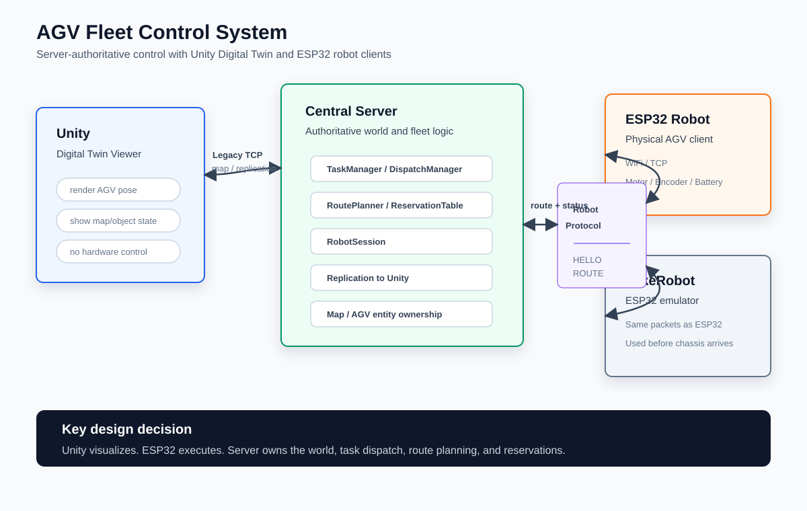
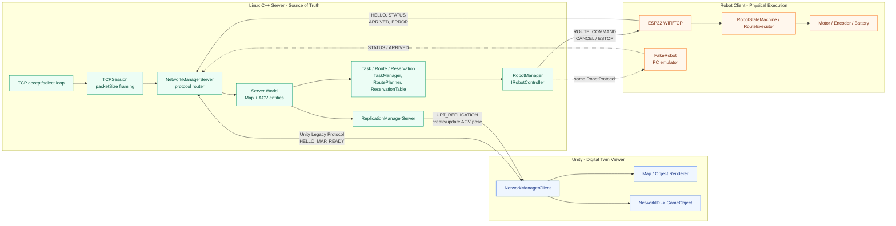
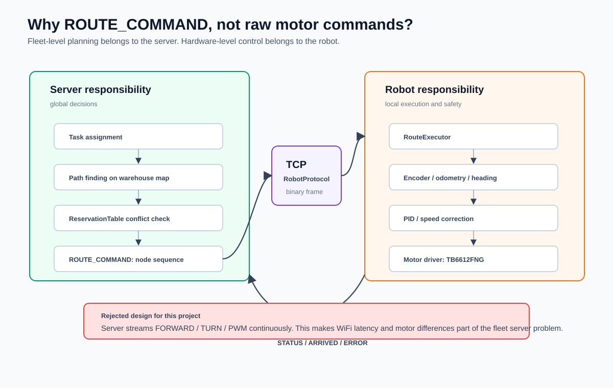
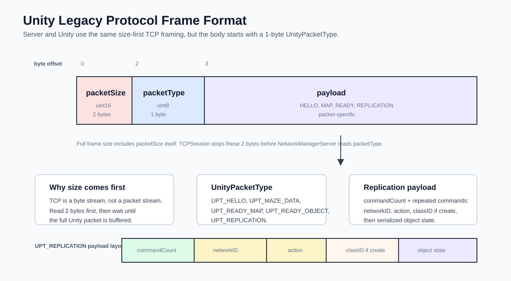
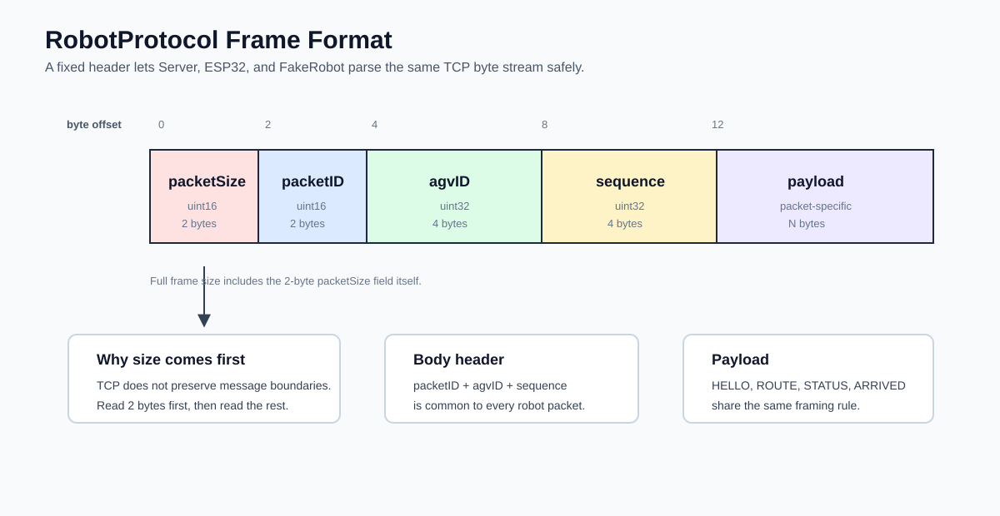
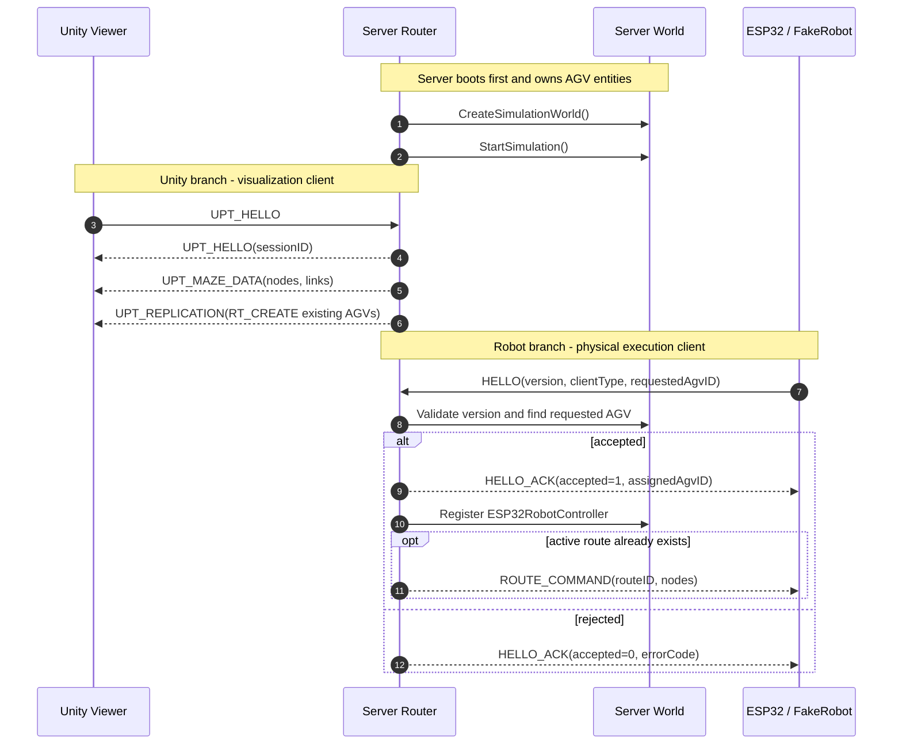
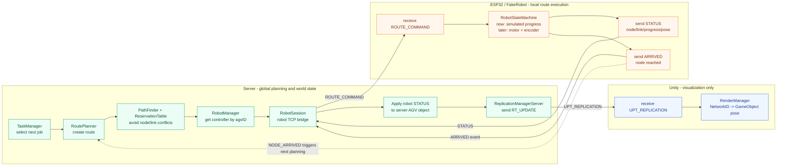
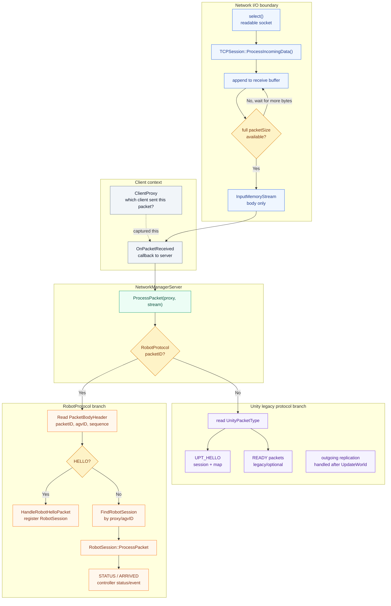

# AGV Communication Protocol

> 상태 안내(2026-08-25): 이 문서는 protocol 설계의 기준이다. 실차와 network firmware의 최신 결합 상태는 [current-status.md](current-status.md)와 [physical-agv-integration.md](physical-agv-integration.md)를 우선한다. 아래의 일부 ESP32 구현 상태와 “차체 도착 전” 설명은 과거 network firmware 기준이다.

이 문서는 AGV Fleet Control System에서 Server, Unity Digital Twin, ESP32 Robot, FakeRobot과 observation-only VisionTracker가 어떻게 통신하는지 설명한다. 포트폴리오에서는 이 문서를 통해 "단순히 소켓을 연결했다"가 아니라, 실제 로봇 확장을 고려해서 프로토콜 경계와 책임을 분리했다는 점을 보여준다.

## 1. 목표

이 프로젝트의 통신 구조 목표는 다음과 같다.

- Server가 중앙 관제탑 역할을 한다.
- Unity는 Server world state를 화면에 그리는 Digital Twin viewer 역할을 한다.
- ESP32는 실제 로봇의 물리 제어와 상태 보고를 담당한다.
- FakeRobot은 ESP32가 없거나 하드웨어 문제가 있을 때 같은 프로토콜로 Server를 테스트하는 로봇 에뮬레이터다.
- Server의 RoutePlanner, ReservationTable, TaskManager는 Unity/ESP32/FakeRobot 중 누가 연결됐는지 몰라도 동작해야 한다.

## 2. 전체 아키텍처

포트폴리오에서는 아래 SVG 그림을 대표 아키텍처 이미지로 쓰는 것을 추천한다. Mermaid 다이어그램은 수정과 공유에는 편하지만, 발표 자료나 포트폴리오에서는 시각적 우선순위가 약해 보일 수 있다.





현재 구조에서 중요한 변화는 Unity가 더 이상 AGV 생성과 시뮬레이션의 주체가 아니라는 점이다. Server가 AGV world를 먼저 만들고, Unity는 Server가 복제해주는 상태를 렌더링한다.

## 3. 통신 채널 구분

이 프로젝트에는 같은 TCP listener에서 식별 후 고정되는 통신 채널이 세 종류 있다.

| 채널 | 사용 주체 | 목적 | 관련 코드 |
|---|---|---|---|
| Unity protocol | Server <-> Unity | 맵 전송, 오브젝트 생성/업데이트 replication | `Shared/header.hpp`, `NetworkManagerServer`, Unity `NetworkManagerClient.cs` |
| RobotProtocol | Server <-> ESP32/FakeRobot | 로봇 등록, route 명령, 상태 보고, 도착 보고, 에러/정지 | `Shared/Protocol.hpp`, `Shared/PacketSerializer.*`, `Server/RobotSession.*`, ESP32 `RobotProtocol.*` |
| Vision observation protocol | VisionTracker -> Server | 보정된 물리 pose 관측의 수신·검증·별도 보관 | `Shared/Protocol.hpp`, `Shared/PacketSerializer.*`, `Server/VisionObservationStore.*` |

첫 frame은 각 protocol의 HELLO여야 한다. 연결이 Unity, Robot 또는 Vision으로 식별되면 같은 socket에서 다른 protocol로 전환할 수 없다. Vision 관측은 RobotSession이나 Unity replication session에 등록되지 않는다.

포트폴리오에서는 RobotProtocol을 중심으로 설명하는 것이 좋다. 실제 AGV 연동의 핵심이 여기에 있기 때문이다.

## 4. 왜 이런 구조인가

### 4.1 Server가 motor command를 직접 보내지 않는 이유

아래 그림은 이 프로젝트에서 가장 중요한 설계 판단을 보여준다.



Server가 직접 `FORWARD`, `TURN_LEFT`, `PWM=120` 같은 저수준 명령을 계속 보내는 구조도 가능하다. 하지만 이 프로젝트에서는 Server가 `ROUTE_COMMAND`를 보내고, ESP32가 그 route를 실제 움직임으로 변환하는 구조를 선택했다.

이유는 다음과 같다.

- WiFi 지연이나 순간 끊김이 있어도 로봇이 local safety를 유지해야 한다.
- 바퀴 크기, 모터 출력, 배터리 상태, 엔코더 해상도는 로봇마다 다를 수 있다.
- Server는 fleet-level planning에 집중해야 하고, ESP32는 hardware-level control에 집중해야 한다.
- 나중에 ESP32 대신 ROS, 다른 MCU, PC 기반 로봇을 붙여도 Server protocol을 유지할 수 있다.

따라서 책임은 이렇게 나눈다.

```text
Server:
  어떤 AGV가 어느 노드를 어떤 순서로 가야 하는지 결정
  예약 기반 충돌 회피
  route command 전송

ESP32:
  받은 route를 local motion command로 변환
  motor / encoder / PID 수행
  STATUS / ARRIVED 보고

Unity:
  Server world state를 시각화
```

### 4.2 FakeRobot을 둔 이유

FakeRobot은 UnityRobotController와 다르다.

- UnityRobotController: Server 내부에서 Unity 시뮬레이션 AGV를 움직이는 controller
- FakeRobot: Server 밖에서 TCP로 접속하는 ESP32 대체 클라이언트

FakeRobot 덕분에 하드웨어가 없어도 다음을 검증할 수 있다.

- TCP frame parsing
- HELLO / HELLO_ACK
- ROUTE_COMMAND 수신
- STATUS 주기 보고
- ARRIVED 이벤트 처리
- Server -> Unity replication

즉 FakeRobot은 하드웨어 문제와 Server protocol 문제를 분리해주는 테스트 장치다.

## 5. Frame Format

Unity protocol과 RobotProtocol은 모두 TCP 위에서 동작한다. TCP는 메시지 단위가 아니라 byte stream이므로, 수신 측이 패킷 경계를 알 수 있도록 맨 앞에 `packetSize`를 둔다.

### 5.1 Unity Legacy Protocol Frame

Unity protocol은 `packetSize` 뒤에 1 byte짜리 `UnityPacketType`을 둔다. 이 protocol은 Unity client에게 map을 보내고, server object를 Unity GameObject로 복제하기 위한 통신이다.



대표 payload:

- `UPT_HELLO`: server가 Unity client에게 sessionID를 알려준다.
- `UPT_MAZE_DATA`: map nodes, links를 전송한다.
- `UPT_REPLICATION`: object create/update/destroy command를 전송한다.
- `UPT_READY_MAP`, `UPT_READY_OBJECT`: legacy 준비 완료 packet이다.

`UPT_REPLICATION` payload는 다음 구조를 가진다.

```text
commandCount
  -> networkID
  -> action
  -> classID        only when RT_CREATE
  -> object state   x, z, heading
```

Unity protocol은 화면 동기화용이므로 `agvID`, `sequence`를 공통 header에 두지 않았다. 대신 object 식별은 replication payload 안의 `networkID`가 담당한다.

### 5.2 RobotProtocol Frame



```text
+-----------------+----------------+--------------+
| Frame Header    | Body Header    | Payload      |
+-----------------+----------------+--------------+
| uint16 size     | uint16 packetID| packet data  |
|                 | uint32 agvID   |              |
|                 | uint32 sequence|              |
+-----------------+----------------+--------------+
```

실제 전체 frame:

| Field | Type | Size | 설명 |
|---|---:|---:|---|
| packetSize | uint16 | 2 | 전체 frame 크기. 이 2 byte도 포함한다. |
| packetID | uint16 | 2 | 패킷 종류 |
| agvID | uint32 | 4 | 대상 또는 송신 AGV ID. 연결 초기에는 0일 수 있다. |
| sequence | uint32 | 4 | 로그 추적, 디버깅, 재접속 추적용 번호 |
| payload | varies | N | packetID별 데이터 |

Server의 `TCPSession`은 앞의 `packetSize` 2 byte를 기준으로 frame을 자른 뒤, payload stream에는 `packetID + agvID + sequence + payload`만 넘긴다. 그래서 코드에는 `PacketHeader`와 `PacketBodyHeader`가 함께 존재한다.

관련 코드:

- Server 공통 정의: `Shared/Protocol.hpp`
- Server serializer: `Shared/PacketSerializer.cpp`
- ESP32 serializer: `ESP32_FinalProject_AGV/include/RobotProtocol.hpp`, `src/RobotProtocol.cpp`
- TCP frame 분리: `Shared/TCPSession.cpp`, ESP32 `RobotClient::processFrames()`

## 6. Packet IDs

| PacketID | Value | Direction | 설명 |
|---|---:|---|---|
| ROUTE_COMMAND | 100 | Server -> Robot | 경로 명령 |
| CANCEL_ROUTE | 101 | Server -> Robot | 현재 경로 취소 |
| TRAJECTORY_COMMAND | 102 | Server -> Robot | capability를 선언한 robot용 local metric waypoint 경로 |
| STATUS | 200 | Robot -> Server | 현재 노드/링크/진행률/좌표/배터리/상태 보고 |
| ARRIVED | 201 | Robot -> Server | 특정 노드 도착 보고 |
| PING | 300 | 양방향 | 연결 확인 요청 |
| PONG | 301 | 양방향 | PING 응답 |
| HELLO | 400 | Client -> Server | 클라이언트 종류와 요청 AGV ID 등록 |
| HELLO_ACK | 401 | Server -> Client | HELLO 승인/거절 |
| ERROR_PACKET | 500 | Robot -> Server | 모터/배터리/장애물 등 에러 보고 |
| EMERGENCY_STOP | 501 | Server -> Robot 또는 Robot -> Server | 비상정지 |
| VISION_HELLO | 600 | VisionTracker -> Server | source/session 및 좌표 계약 등록 |
| VISION_HELLO_ACK | 601 | Server -> VisionTracker | 기능/계약 승인 또는 거절 |
| VISION_OBSERVATION | 602 | VisionTracker -> Server | 관측 전용 `MEASURED/HELD/LOST` 보고 |

## 7. ClientType

| ClientType | Value | 설명 |
|---|---:|---|
| UNKNOWN | 0 | 미지정 |
| UNITY | 1 | 예약값. 현재 Unity는 legacy protocol 사용 |
| ESP32 | 2 | 실제 ESP32 로봇 |
| TOOL | 3 | 디버깅/관리 도구 확장용 |
| FAKE_ROBOT | 4 | FakeRobot TCP emulator |
| VISION_TRACKER | 5 | AprilTag 관측 source. Robot HELLO에는 사용하지 않음 |

ESP32 쪽 코드에서는 Arduino 환경의 `ESP32` 매크로 이름 충돌을 피하기 위해 `ESP32_ROBOT` 이름을 사용하지만, wire value는 Server의 `ESP32 = 2`와 같다.

## 8. RobotState

| RobotState | Value | 의미 |
|---|---:|---|
| UNKNOWN | 0 | 상태 미정 |
| IDLE | 1 | 대기 |
| MOVING | 2 | 이동 중 |
| LOADING | 3 | 상차 중 |
| UNLOADING | 4 | 하차 중 |
| WAIT_REPLAN | 5 | 재경로 대기 |
| FAULT | 100 | 장애 상태 |
| EMERGENCY_STOPPED | 101 | 비상정지 상태 |

`LOADING`, `UNLOADING`을 RobotState에 둔 이유는 실제 물류 흐름에서 AGV가 단순히 움직이는 것뿐 아니라 상하차 작업 상태도 Digital Twin에 표시해야 하기 때문이다.

## 9. ErrorCode

| ErrorCode | Value | 의미 |
|---|---:|---|
| NONE | 0 | 정상 |
| PROTOCOL_MISMATCH | 1 | protocolVersion 불일치 |
| UNKNOWN_AGV | 2 | Server world에 없는 AGV ID 요청 |
| MOTOR_FAULT | 100 | 모터 장애 |
| LOW_BATTERY | 101 | 배터리 부족 |
| OBSTACLE_DETECTED | 102 | 장애물 감지 |

## 10. Payload Schema

### 10.1 HELLO

Direction: Client -> Server

| Field | Type | 설명 |
|---|---|---|
| protocolVersion | uint16 | 현재 `1` |
| clientType | uint8 | ESP32 또는 FAKE_ROBOT |
| requestedAgvID | uint32 | 연결하고 싶은 AGV ID |
| capabilities | uint32, optional | 지원 기능 bit mask. 생략한 기존 v1 client는 0으로 처리 |

사용 이유:

- Server가 Unity client와 robot client를 구분한다.
- ESP32가 어떤 Server-side AGV entity에 붙을지 요청한다.
- protocolVersion으로 Server와 firmware의 wire format 불일치를 초기에 잡는다.

### 10.2 HELLO_ACK

Direction: Server -> Client

| Field | Type | 설명 |
|---|---|---|
| protocolVersion | uint16 | Server protocol version |
| accepted | uint8 | 1이면 승인, 0이면 거절 |
| assignedAgvID | uint32 | Server가 배정한 AGV ID |
| errorCode | uint16 | 거절 이유 |

대표 흐름:

- `accepted=1`, `errorCode=NONE`: 등록 성공
- `accepted=0`, `errorCode=UNKNOWN_AGV`: requestedAgvID가 Server world에 없음
- `accepted=0`, `errorCode=PROTOCOL_MISMATCH`: firmware와 Server의 protocol version 불일치

### 10.3 ROUTE_COMMAND

Direction: Server -> Robot

| Field | Type | 설명 |
|---|---|---|
| routeID | uint32 | Server가 route마다 부여하는 ID |
| nodeCount | uint16 | route node 수. 최대 64 |
| nodes[i].nodeID | uint32 | 경유 노드 ID |
| nodes[i].arrivalTime | float | 해당 노드 도착 예정 시간 |
| nodes[i].departureTime | float | 해당 노드 출발 예정 시간 |

Server는 `RoutePlanner`가 만든 PathStep을 `RouteNodeTime` 배열로 바꿔 전송한다. ESP32는 현재 임시 구현에서 시간 기반으로 progress를 올리고 있지만, 최종 구현에서는 이 node sequence를 local route executor가 받아서 `rotate`, `drive`, `stop` 같은 내부 motion command로 변환한다.

### 10.3.1 TRAJECTORY_COMMAND

Direction: Server -> Robot

`HELLO.capabilities`의 두 bit는 의도적으로 다른 의미를 가진다.

- `CAPABILITY_TRAJECTORY_COMMAND`: follower, safety, STATUS/ARRIVED까지 포함한 완전 실행 지원
- `CAPABILITY_TRAJECTORY_PREVIEW`: parse/validate/store/log만 지원하며 motion dispatch 대상이 아님

기존 v1 ESP32처럼 optional capability field를 생략한 client에는 계속 `ROUTE_COMMAND`만 사용한다. Preview bit만 선언한 client에도 Server가 trajectory 실행을 요구하면 안 된다.

| Field | Type | 설명 |
|---|---|---|
| routeID | uint32 | trajectory 식별자 |
| formatVersion | uint8 | trajectory payload 형식. 현재 값은 1 |
| waypointCount | uint16 | waypoint 수, 1~64 |
| startNodeID | uint32 | 출발 node |
| finalNodeID | uint32 | 최종 node |
| millimetersPerMapUnit | float | 생성에 사용한 map→metric scale, 진단·검증용 |
| waypoints[i].forwardMm | float | 신뢰된 실제 시작 heading 방향을 +축으로 한 전방 거리 mm |
| waypoints[i].leftMm | float | 시작 heading에서 반시계 90도를 +축으로 한 좌측 거리 mm |
| waypoints[i].headingRad | float | 신뢰된 실제 시작 heading을 0으로 한 상대 heading radian |
| waypoints[i].targetSpeedMmPerSecond | float | 상위 목표 속도. firmware local safety limit가 항상 우선 |
| waypoints[i].nodeID | uint32 | node boundary가 아니면 0, boundary면 해당 node ID |
| waypoints[i].flags | uint8 | node/stop/rotate/final bit mask |

Waypoint flag:

| Flag | Value | 의미 |
|---|---:|---|
| NODE_BOUNDARY | 1 | server map node 경계 |
| STOP | 2 | 이 waypoint에서 정지 |
| ROTATE_IN_PLACE | 4 | 같은 위치에서 heading을 맞춘 뒤 진행 |
| FINAL | 8 | trajectory 최종 waypoint |

Wire order는 `routeID -> formatVersion -> waypointCount -> startNodeID -> finalNodeID -> millimetersPerMapUnit -> waypoints`로 고정한다. 최대 payload는 `19 + 64 * 21 = 1363 byte`, RobotProtocol body/frame header를 포함한 전체 TCP frame은 1375 byte다. waypoint가 64개를 넘으면 server는 조용히 자르지 않고 trajectory 생성을 실패시킨다. 알 수 없는 format version이나 trailing byte도 거부한다. 장거리 경로 chunking은 아직 구현하지 않았다.

Server sampler는 directed node link를 순서대로 확인한 뒤 다음처럼 처리한다.

- `type=0`: 직선 보간
- `type=1`: `cx1/cz1`, `cx2/cz2` cubic Bezier
- cubic curve는 조밀한 parameter sample의 누적 chord length를 만들고 요청 spacing에 맞춰 등거리 근사 재샘플링
- robot-local frame은 first-link tangent가 아니라 신뢰된 실제 시작 pose heading을 사용하며, heading이 없거나 non-finite이면 build 실패
- 시작 자세와 첫 link 접선 차이가 threshold보다 크면 origin STOP과 `nodeID=0`인 `ROTATE_IN_PLACE` waypoint 삽입
- 다음 link 접선 변화가 threshold보다 크면 `STOP`과 `ROTATE_IN_PLACE` 삽입
- synthetic rotate waypoint는 node 도착을 중복 보고하지 않도록 `nodeID=0`이며 `NODE_BOUNDARY`를 갖지 않음
- 접선이 이어지는 LINE/BEZIER 경계는 정지 없이 연속 waypoint 생성

2026-08-11 기준 `60 mm/map-unit` TestCase03 `[1 -> 4]` preview와 ESP32 motor-disabled follower trace가 통과했다. `--trajectory-preview`는 preview-only client에 speed 0만 보내고, `--trajectory-raised-wheel`은 command-capable client에만 `80 mm/s` 실행 trajectory를 보낸다. 두 mode 모두 자동 배차와 RoutePlanner를 사용하지 않으며, 기존 `--physical-demo`는 계속 `[1 -> 2]` `ROUTE_COMMAND`를 사용한다.

### 10.3.2 Vision observation packets

Vision receiver는 기본값이 OFF다. 실제 카메라 보정 뒤 다음처럼 calibration identity를 명시한 경우에만 활성화한다.

```bash
./build/Server/AGV_Server --vision-observation \
  --vision-calibration-id <LOCKED_CALIBRATION_ID>
```

현재 검토 기준은 VisionTracker commit `278cc431`의 TestCase0 계약이다.

- source ID 기본값: `1` (`--vision-source-id`로 변경 가능)
- map contract: `dd2c1523295b02ee`
- pose contract: `f84eb43ebb6cf7ff`
- 좌표: node 1 `(50,-36)` 원점, `50 mm/map-unit`, `0 deg=+x`, 반시계가 양수

기능을 켤 때 Server는 active map의 node 1~15 ID와 좌표 전체가 이 canonical contract와 일치하는지도 확인한다. 한 node라도 다르면 main loop 진입 전에 startup을 실패시켜 이전 digest를 잘못 승인하지 않는다.

`VISION_HELLO` payload:

| Field | Type | 설명 |
|---|---|---|
| protocolVersion | uint16 | 현재 1 |
| sourceID | uint32 | 카메라/프로세스 source identity, 0 금지 |
| sessionID | uint64 | 프로세스 재시작마다 새 값, low uint32 뒤 high uint32 순서 |
| mapContractID | uint16 length + bytes | 1~64자 visible ASCII |
| poseContractID | uint16 length + bytes | 1~64자 visible ASCII |

`VISION_HELLO_ACK`은 version, accepted, rejection reason, sourceID와 sessionID를 돌려준다. 기능 OFF, protocol/source 오류, map/pose 계약 불일치와 중복 session을 구분해 거절한다.

`VISION_OBSERVATION`의 공통 header `agvID`는 관측 대상 AGV이며 `sequence`는 승인된 source/session에서 엄격히 증가해야 한다. 이 값은 Python `PoseEstimate.source_sequence`와 별도인 transport sequence다. MEASURED뿐 아니라 HELD/LOST를 보낼 때도 packet마다 증가시키며, Server가 payload를 거부했더라도 같은 sequence를 재사용하지 않는다. source/session과 map/pose 계약은 TCP session의 승인된 HELLO에서 가져오며 packet마다 다시 신뢰하지 않는다.

| Field | Type | 설명 |
|---|---|---|
| sourceTimestampUs | uint64 | sender process-local monotonic metadata. Server 시계와 직접 비교 금지 |
| reportedAgeMs | uint32 | sender가 계산한 관측 age |
| trackingState | uint8 | `MEASURED=1`, `HELD=2`, `LOST=3` |
| xMm, zMm, headingDeg | float x3, conditional | MEASURED/HELD에만 존재. LOST에는 byte 자체가 없음 |
| calibrationID | uint16 length + bytes | 실행 옵션의 locked calibration ID와 일치해야 함 |
| verificationState | uint8 | verified/awaiting/missing/mismatch/stale/invalid 상태 |
| qualityFields | uint16 | 뒤 quality 값의 유효 필드 mask |
| decisionMargin | float | quality bit 0 |
| calibrationRmsErrorMm | float | quality bit 1 |
| verificationReferenceCount | uint16 | quality bit 2 |
| verificationRmsErrorMm | float | quality bit 3 |
| verificationMaxErrorMm | float | quality bit 4 |
| verificationCoverageRatio | float | quality bit 5, 0~1 |
| verificationAgeMs | uint32 | quality bit 6 |

quality scalar는 위 순서로 항상 모두 전송한다. 대응 bit가 없는 scalar는 canonical `0`이어야 하며 Server는 non-zero/NaN placeholder를 거부한다.

실제 sender transport는 locked calibration이 생긴 뒤에만 활성화한다. 따라서 LOST도 승인된 calibration ID를 보낸다. 아직 한 번도 측정되지 않은 초기 LOST는 `sourceTimestampUs=0`, `reportedAgeMs=0`, pose 없음으로 인코딩한다. 측정 이후 LOST의 sender timestamp/age는 진단용일 뿐이며 Server는 pose로 재사용하지 않는다.

Server는 non-finite/범위 밖 pose, 잘못된 AGV·identity, stale age, 역순 sequence, 잘못된 state/pose 조합과 quality를 거부한다. freshness는 sender timestamp가 아니라 Server의 monotonic receive time으로 판단한다. 저장 위치는 `VisionObservationStore`이며 다음 값과 섞지 않는다.

- Server 계획/authoritative pose
- ESP32 encoder/status pose
- ARRIVED, RoutePlanner, ReservationTable, OccupancyProvider, TaskManager

따라서 이 단계의 Vision packet은 로봇 명령, 도착 판정, 재계획 또는 Unity의 기존 AGV 위치를 변경하지 않는다.

### 10.4 STATUS

Direction: Robot -> Server

| Field | Type | 설명 |
|---|---|---|
| currentNodeID | uint32 | 현재 기준 노드 |
| currentLinkID | uint32 | 현재 이동 목표 노드 또는 link 정보 |
| progress | float | 현재 구간 진행률 0.0~1.0 |
| x | float | 실제/추정 x 좌표 |
| z | float | 실제/추정 z 좌표 |
| heading | float | heading radian |
| velocity | float | 속도 |
| battery | float | 배터리 퍼센트 |
| state | uint8 | RobotState |

현재 ESP32 임시 코드는 실제 위치 추정이 없으므로 `currentNodeID`, `currentLinkID`, `progress`를 주로 사용한다. Server의 `RobotSession`은 이 값을 MapData와 `BezierFollower`로 변환해서 Unity에 자연스러운 좌표로 복제한다.

### 10.5 ARRIVED

Direction: Robot -> Server

| Field | Type | 설명 |
|---|---|---|
| currentNodeID | uint32 | 도착한 노드 |

Server는 ARRIVED를 받으면 `ControllerEvent::ARRIVED`로 바꾸고, `NetworkManagerServer::UpdateWorld()`에서 `RobotEventType::NODE_ARRIVED`로 publish한다. 이후 `RoutePlanner::OnRobotStepCompleted()`가 다음 계획 상태를 갱신한다.

다중-node `TRAJECTORY_COMMAND`도 각 `NODE_BOUNDARY`에서 정지·settling 후 해당 node의 ARRIVED를 정확히 한 번 전송해야 한다. `nodeID=0`인 synthetic `ROTATE_IN_PLACE`에서는 ARRIVED를 보내지 않는다. Server는 계획상의 다음 node와 다르면 route를 safe-stop한다.

### 10.6 CANCEL_ROUTE

Direction: Server -> Robot

Payload 없음.

로봇은 현재 route 실행을 중단하고 안전 정지한다.

### 10.7 EMERGENCY_STOP

Direction: Server -> Robot 또는 Robot -> Server

Payload 없음.

긴급 상황에서 즉시 모터 출력을 차단하기 위한 패킷이다. ESP32에서는 `motorDriver.emergencyStop()`이 TB6612FNG STBY까지 LOW로 내리는 강한 정지 역할을 한다.

### 10.8 PING / PONG

Direction: 양방향

| Field | Type | 설명 |
|---|---|---|
| timestampMs | uint32 | 송신 측 timestamp |

현재 ESP32는 B 방식으로 동작한다.

- ESP32가 STATUS를 계속 보낸다.
- Server는 필요할 때만 명령을 보낸다.
- Server가 조용하다는 이유만으로 ESP32가 emergency stop하지 않는다.

이 정책은 `Config.hpp`의 `kEnableServerSilenceTimeout = false`로 반영되어 있다.

## 11. Connection Sequence

포트폴리오에는 아래 흐름 그림을 먼저 보여주고, 그 아래에 세부 packet table을 배치하는 구성을 추천한다.



## 12. Route Execution Sequence



## 13. Server Processing Pipeline



핵심 설계:

- `TCPSession`은 TCP byte stream을 frame으로 자르는 일만 담당한다.
- `NetworkManagerServer`는 Unity protocol과 RobotProtocol을 분기한다.
- `RobotSession`은 robot packet을 Server-side controller event와 status로 변환한다.
- `ESP32RobotController`는 route command 송신과 status/event 조회를 담당한다.

## 14. ESP32 Processing Pipeline

```mermaid
flowchart LR
    %% Network connection
    subgraph Network["Network connection"]
        BOOT["boot"]
        WIFI["connect WiFi"]
        TCP{"TCP connected?"}
        HELLO["send HELLO"]

        BOOT --> WIFI --> TCP
        TCP -->|No| WIFI
        TCP -->|Yes| HELLO
    end

    %% Packet parser
    subgraph Parser["RobotProtocol parser"]
        READ["readIncoming()"]
        FRAME["processFrames()<br/>packetSize based"]
        DISPATCH{"packetID"}

        READ --> FRAME --> DISPATCH
    end

    %% Server commands
    subgraph Commands["Commands from Server"]
        ACK["HELLO_ACK<br/>assignedAgvID"]
        ROUTE["ROUTE_COMMAND<br/>routeID + node list"]
        CANCEL["CANCEL_ROUTE"]
        ESTOP["EMERGENCY_STOP"]

        DISPATCH -->|HELLO_ACK| ACK
        DISPATCH -->|ROUTE_COMMAND| ROUTE
        DISPATCH -->|CANCEL_ROUTE| CANCEL
        DISPATCH -->|EMERGENCY_STOP| ESTOP
    end

    %% Runtime state
    subgraph CurrentRuntime["Current runtime before chassis arrives"]
        SIM["RobotStateMachine<br/>time/progress simulation"]
        SIM_STATUS["STATUS<br/>simulated node/progress"]
        SIM_ARRIVED["ARRIVED<br/>when simulated leg ends"]

        ROUTE --> SIM
        SIM --> SIM_STATUS
        SIM --> SIM_ARRIVED
    end

    subgraph FutureRuntime["Future runtime after chassis arrives"]
        EXEC["RouteExecutor"]
        MOTION["MotionController<br/>turn / drive / stop"]
        HW["TB6612FNG + EncoderReader"]
        REAL_STATUS["STATUS<br/>real pose/velocity/battery"]
        REAL_ARRIVED["ARRIVED<br/>encoder-based arrival"]

        ROUTE -.-> EXEC -.-> MOTION -.-> HW
        HW -.-> REAL_STATUS
        HW -.-> REAL_ARRIVED
    end

    subgraph ServerLink["Server"]
        SERVER["RobotSession<br/>server-side endpoint"]
    end

    HELLO -->|TCP| SERVER
    SERVER -->|HELLO_ACK / ROUTE / CANCEL / ESTOP| READ
    SIM_STATUS -->|TCP| SERVER
    SIM_ARRIVED -->|TCP| SERVER
    REAL_STATUS -.->|TCP| SERVER
    REAL_ARRIVED -.->|TCP| SERVER
    CANCEL --> SIM
    ESTOP --> SIM
    CANCEL -.-> MOTION
    ESTOP -.-> MOTION

    classDef network fill:#eff6ff,stroke:#2563eb,color:#1e3a8a
    classDef parser fill:#f5f3ff,stroke:#7c3aed,color:#4c1d95
    classDef command fill:#fff7ed,stroke:#f97316,color:#7c2d12
    classDef current fill:#ecfdf5,stroke:#059669,color:#064e3b
    classDef future fill:#f8fafc,stroke:#64748b,color:#334155,stroke-dasharray:6 4
    classDef server fill:#fee2e2,stroke:#ef4444,color:#7f1d1d
    classDef decision fill:#fef3c7,stroke:#d97706,color:#78350f

    class BOOT,WIFI,HELLO network
    class READ,FRAME parser
    class ACK,ROUTE,CANCEL,ESTOP command
    class SIM,SIM_STATUS,SIM_ARRIVED current
    class EXEC,MOTION,HW,REAL_STATUS,REAL_ARRIVED future
    class SERVER server
    class TCP,DISPATCH decision
```



현재 ESP32의 `RobotStateMachine`은 하드웨어가 없을 때 route loop를 검증하기 위한 임시 구현이다. 실제 차체가 오면 `RouteExecutor`, `MotionController`, `EncoderReader`를 추가해서 다음 구조로 발전시키는 것이 좋다.

```text
ROUTE_COMMAND
  -> RouteExecutor
  -> MotionController
  -> MotorDriver / EncoderReader
  -> STATUS / ARRIVED
```

## 15. 왜 Serializer를 쓰는가

프로토콜에서 구조체를 그대로 `send(sock, &packet, sizeof(packet))` 하지 않는 이유는 다음과 같다.

- C++ compiler padding 문제가 생길 수 있다.
- ESP32, PC, Unity, Python 등 다른 환경에서 구조체 layout이 달라질 수 있다.
- TCP frame이 부분 수신될 수 있으므로 길이 검증이 필요하다.
- packetID별 payload를 명시적으로 읽고 쓰면 디버깅이 쉽다.

그래서 Server와 ESP32 모두 `WriteUInt16`, `WriteUInt32`, `WriteFloat` 계열 serializer를 사용한다.

## 16. 현재 구현 상태

완료:

- Server-authoritative world 생성
- Unity Digital Twin viewer 구조
- ESP32/FakeRobot TCP client 접속
- HELLO / HELLO_ACK
- ROUTE_COMMAND
- STATUS
- ARRIVED
- ERROR_PACKET
- EMERGENCY_STOP packet ID 정의
- FakeRobot을 통한 protocol test
- ESP32 accepted=1 연결 확인
- Server에서 ESP32 STATUS를 map pose로 변환

임시 구현:

- ESP32는 아직 실제 encoder 기반 위치 추정이 없다.
- ESP32 `RobotStateMachine`은 route leg를 시간 기반으로 진행한다.
- 실제 motor control은 `kEnableMotorOutputs=false`로 막아둔 상태에서 시작한다.

남은 작업:

- ESP32 RouteExecutor 구현
- EncoderReader 구현
- MotionController 구현
- TB6612FNG motor test
- reconnect 시 기존 RobotSession 정리 보강
- Server-side robot offline timeout
- 실제 위치와 Unity 위치 오차 로그

## 17. 포트폴리오에 넣을 코드 스니펫 후보

### Packet definition

```cpp
enum class PacketID : uint16_t
{
    ROUTE_COMMAND = 100,
    CANCEL_ROUTE = 101,
    STATUS = 200,
    ARRIVED = 201,
    PING = 300,
    PONG = 301,
    HELLO = 400,
    HELLO_ACK = 401,
    ERROR_PACKET = 500,
    EMERGENCY_STOP = 501
};
```

### Size-first frame parsing

```cpp
if (m_ReceiveBuffer.size() < sizeof(uint16_t))
    break;

uint16_t packetSize = *reinterpret_cast<uint16_t*>(m_ReceiveBuffer.data());
if (m_ReceiveBuffer.size() < packetSize)
    break;
```

### Robot HELLO routing

```cpp
if (packetID == RobotProtocol::PacketID::HELLO)
{
    HandleRobotHelloPacket(_proxy, header, _stream);
    return true;
}
```

### Route send

```cpp
void RobotSession::SendRoute(const RoutePacket& routePacket)
{
    RobotProtocol::RouteCommandPayload payload;
    payload.routeID = m_NextRouteID++;
    payload.nodes = routePacket.nodes;

    OutputMemoryStream payloadStream;
    RobotProtocol::WriteRouteCommandPayload(payloadStream, payload);
    SendRobotPacket(RobotProtocol::PacketID::ROUTE_COMMAND, routePacket.agvID, payloadStream);
}
```

## 18. 테스트 시나리오

### Scenario A: ESP32 registration

1. Server 실행
2. ESP32 전원 연결
3. ESP32가 WiFi 접속
4. ESP32가 Server TCP 접속
5. ESP32가 HELLO 전송
6. Server가 HELLO_ACK accepted=1 응답

성공 로그:

```text
[RobotProtocol] Robot client connected. agvID=1 clientType=2 sequence=1
[RobotProtocol] HELLO_ACK accepted=1 agvID=1 error=0
```

### Scenario B: route loop

1. Server TaskManager가 route 생성
2. Server가 ROUTE_COMMAND 전송
3. ESP32가 ROUTE_COMMAND 수신
4. ESP32가 STATUS 주기 보고
5. ESP32가 ARRIVED 보고
6. Server가 NODE_ARRIVED 처리
7. Unity가 AGV 위치 update

성공 로그:

```text
[RobotProtocol] Send ROUTE_COMMAND agvID=1 routeID=... nodes=...
[RobotProtocol] ROUTE routeID=... nodes=...
[AGV] ARRIVED node=...
```

## 19. 포트폴리오 문장 예시

> Unity 시뮬레이션에서 끝나는 프로젝트가 아니라, Server-authoritative 구조로 AGV world를 관리하고 ESP32 기반 실제 로봇을 같은 TCP protocol에 연결할 수 있도록 설계했다. TCP의 stream 특성을 고려해 size-first frame protocol을 정의했고, HELLO/ROUTE/STATUS/ARRIVED 흐름으로 Server, Unity Digital Twin, ESP32 Robot의 책임을 분리했다.
