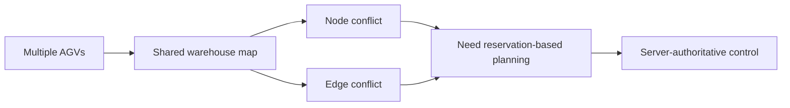
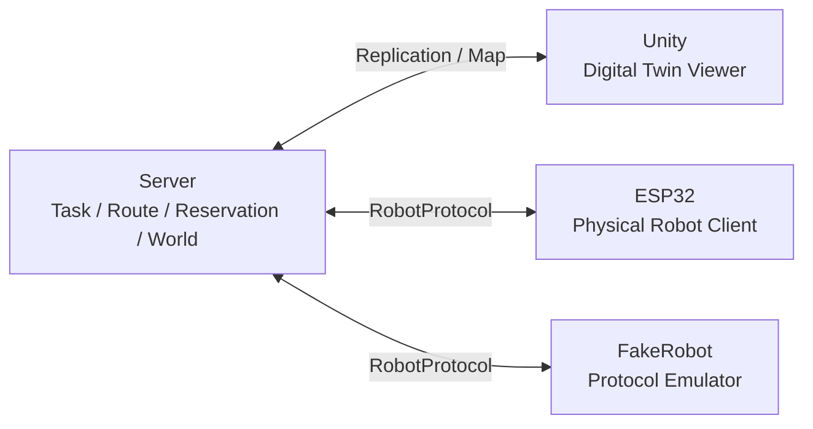
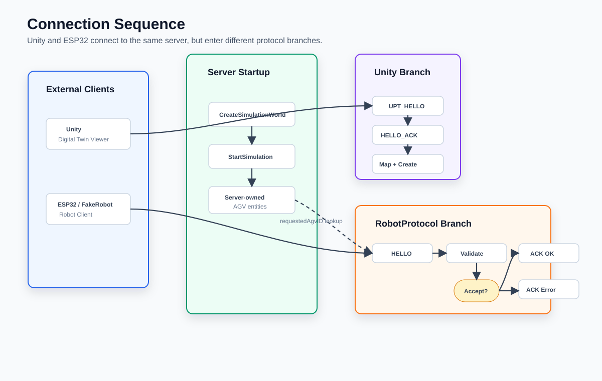
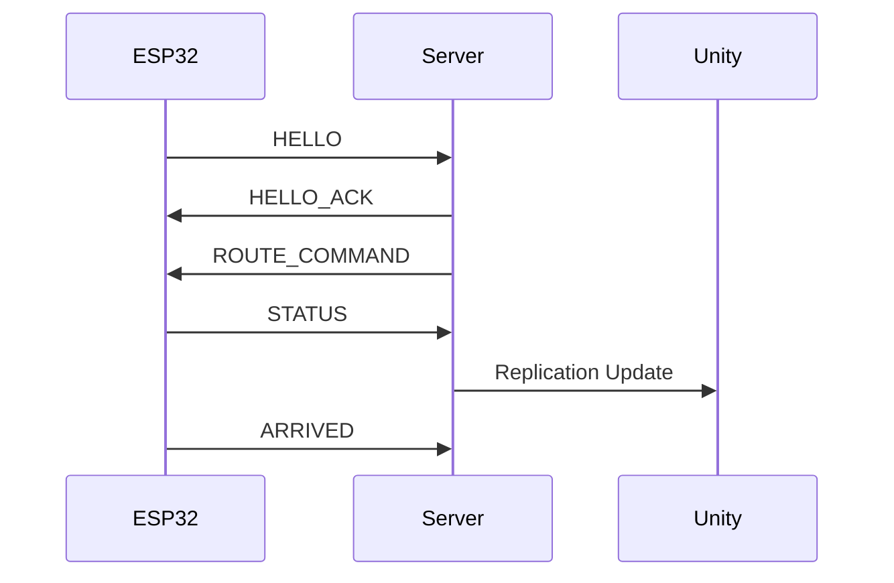

# AGV Fleet Control System Portfolio Guide

이 문서는 차체가 도착하기 전까지 포트폴리오를 어떤 방향으로 준비하면 좋은지 정리한 가이드다. 지금 단계의 핵심은 "아직 실제 주행이 안 됐다"를 숨기는 것이 아니라, 실제 하드웨어로 확장 가능한 구조와 통신 프로토콜을 이미 검증했다는 점을 보여주는 것이다.

## 1. 포트폴리오 핵심 메시지

추천 메시지:

> Server-authoritative AGV Fleet Control System을 구축하고, Unity Digital Twin과 ESP32 기반 실제 로봇을 같은 관제 서버에 연결할 수 있는 TCP protocol을 설계했다.

피해야 할 메시지:

> Unity에서 AGV가 움직입니다.

이 프로젝트의 강점은 Unity 화면 자체보다 다음에 있다.

- 중앙 서버가 AGV world를 소유한다.
- RoutePlanner와 ReservationTable로 다중 AGV 충돌을 관리한다.
- Unity는 viewer 역할로 분리했다.
- ESP32는 실제 로봇 client로 연결된다.
- FakeRobot으로 하드웨어 없이 protocol loop를 검증했다.

## 2. 추천 포트폴리오 구조

### 2.1 Project Overview

짧게 보여줄 내용:

- 프로젝트명: AGV Fleet Control System
- 역할: 개인 프로젝트 또는 팀 프로젝트 내 담당 범위
- 기술: C++, TCP socket, Unity C#, ESP32 Arduino/PlatformIO, path planning, reservation table
- 목적: 다중 AGV 관제, 디지털 트윈, 실제 로봇 연동

예시 문장:

> 창고 환경에서 여러 AGV의 작업 배정, 경로 계획, 충돌 회피, 실제 로봇 연동을 하나의 서버에서 관리하는 관제 시스템을 구현했다. Unity는 디지털 트윈 viewer로 사용하고, ESP32는 실제 로봇 client로 TCP protocol에 연결했다.

### 2.2 Problem

문제 정의:

- 여러 AGV가 동시에 움직이면 노드/링크 충돌이 발생한다.
- 시뮬레이션과 실제 로봇이 다른 구조로 움직이면 디버깅이 어렵다.
- 실제 로봇이 늦게 준비되어도 서버와 protocol 검증은 먼저 진행해야 한다.

보여줄 그림:



### 2.3 Architecture

반드시 넣을 그림:


이 그림에서 바로 보여줘야 하는 메시지는 하나다.

> Server가 world와 route를 소유하고, Unity와 ESP32는 각각 viewer/client로 붙는다.

수정용 Mermaid 원본:



설명 포인트:

- Server가 authoritative source다.
- Unity는 Server state를 그린다.
- ESP32는 route를 받고 STATUS/ARRIVED를 보고한다.
- FakeRobot은 하드웨어 전 검증용이다.

### 2.4 Communication Protocol

이 섹션은 `docs/CommunicationProtocol.md`를 기반으로 만든다.

대표 그림:


넣을 내용:

- size-first TCP frame
- PacketID table
- HELLO / HELLO_ACK
- ROUTE_COMMAND
- STATUS / ARRIVED
- 왜 Server가 `forward/turn`을 직접 보내지 않는지

추천 그림:



수정용 Mermaid 원본:



### 2.5 Path Planning / Reservation

보여줄 내용:

- AGV가 목표 노드로 이동하려고 할 때 PathFinder가 경로를 찾는다.
- ReservationTable이 시간 구간별 노드/링크 점유를 확인한다.
- 충돌 위험이 있으면 WAIT_REPLAN 또는 pending route로 넘긴다.

추천 표현:

> 단순 최단거리 이동이 아니라, 노드와 링크를 시간 구간 단위로 예약해 다중 AGV의 충돌 가능성을 줄였다.

### 2.6 Digital Twin

현재 상태를 정직하게 표현하는 것이 좋다.

좋은 표현:

> Unity는 Server가 복제하는 AGV 위치와 heading을 렌더링한다. ESP32의 STATUS가 Server에 반영되면 같은 AGV entity가 Unity에서 갱신된다.

주의할 표현:

> Unity가 실제 로봇을 제어한다.

이건 피하는 게 좋다. 최종 구조는 Unity control이 아니라 Unity visualization이다.

### 2.7 Hardware Integration Status

차체 도착 전이라면 이렇게 적는다.

현재 완료:

- ESP32 WiFi 연결
- Server TCP 접속
- HELLO / HELLO_ACK
- ROUTE_COMMAND 수신
- STATUS / ARRIVED 송신
- Unity Digital Twin 반영

진행 예정:

- TB6612FNG motor driver 연결
- encoder input reading
- RouteExecutor 구현
- MotionController 구현
- 실제 주행 보정

이렇게 쓰면 아직 차체가 없어도 "계획이 비어 있음"이 아니라 "통신 layer까지 검증 완료, hardware layer 진행 예정"으로 보인다.

## 3. 포트폴리오에 넣을 자료

### 3.1 스크린샷 / 영상

준비하면 좋은 자료:

- Server console: `Robot client connected`, `Send ROUTE_COMMAND`
- ESP32 serial monitor: `HELLO_ACK accepted=1`, `ROUTE routeID=...`
- Unity 화면: AGV들이 맵 위에서 움직이는 장면
- WSL/Windows port forwarding 구성 메모
- FakeRobot 실행 로그

영상 흐름:

1. Server 실행
2. ESP32 연결 로그
3. Unity 실행
4. ROUTE_COMMAND
5. STATUS/ARRIVED
6. Unity AGV 위치 갱신

### 3.2 다이어그램

지금 바로 사용할 수 있게 만든 포트폴리오용 SVG:

- `docs/assets/architecture-overview.svg`
- `docs/assets/unity-protocol-frame.svg`
- `docs/assets/packet-frame.svg`
- `docs/assets/protocol-sequence.svg`
- `docs/assets/responsibility-split.svg`
- `docs/assets/route-execution-flow.svg`
- `docs/assets/server-processing-flow.svg`
- `docs/assets/esp32-processing-flow.svg`

각 그림의 용도:

- `architecture-overview.svg`: 전체 시스템 아키텍처
- `unity-protocol-frame.svg`: Unity legacy protocol frame과 replication payload
- `packet-frame.svg`: TCP frame format
- `protocol-sequence.svg`: HELLO, ROUTE, STATUS, ARRIVED 흐름
- `responsibility-split.svg`: 왜 Server가 motor command를 직접 보내지 않는지
- `route-execution-flow.svg`: route 생성부터 Unity 반영까지의 실행 흐름
- `server-processing-flow.svg`: Server 내부 packet 처리 pipeline
- `esp32-processing-flow.svg`: ESP32 firmware 내부 처리 pipeline

Mermaid는 문서 내부의 수정용 원본으로 유지하고, 포트폴리오 페이지/PDF에는 SVG를 메인 이미지로 쓰는 것을 추천한다.

### 3.3 코드 스니펫

너무 많은 코드를 넣기보다 "설계 의도가 보이는 코드"만 넣는 것이 좋다.

추천 후보:

- `PacketID` enum
- `PacketHeader` / `PacketBodyHeader`
- `WriteRouteCommandPayload`
- `RobotSession::ProcessPacket`
- `NetworkManagerServer::HandleRobotHelloPacket`
- ESP32 `RobotClient::processFrames`
- ESP32 `RobotStateMachine::loadRoute`

## 4. 페이지 구성 예시

### 4.1 첫 화면

제목:

```text
AGV Fleet Control System
Server-authoritative control with Unity Digital Twin and ESP32 Robot Client
```

요약:

```text
C++ server controls multi-AGV routing, reservation-based collision avoidance, Unity visualization, and ESP32 robot communication through a custom TCP protocol.
```

### 4.2 Section 1: Why

- 다중 AGV 충돌 문제
- Unity simulation과 실제 robot 연결 문제
- 서버 중심 관제 필요성

### 4.3 Section 2: Architecture

- 전체 구성도
- Server / Unity / ESP32 / FakeRobot 역할
- 대표 이미지: `architecture-overview.svg`

### 4.4 Section 3: Protocol

- Frame format
- Packet table
- Sequence diagram
- 대표 이미지: `packet-frame.svg`, `protocol-sequence.svg`
- 설계 판단 이미지: `responsibility-split.svg`

### 4.5 Section 4: Routing and Reservation

- Path planning
- Reservation table
- Replan / execution blocked

### 4.6 Section 5: Demo

- 로그
- Unity 화면
- ESP32 serial monitor

### 4.7 Section 6: Next Step

- Motor driver
- Encoder
- PID
- 실제 robot calibration

## 5. 지금 바로 만들 문서 우선순위

1. `CommunicationProtocol.md`
2. `Architecture.md`
3. `DemoScenario.md`
4. `HardwareBringupPlan.md`
5. 포트폴리오 웹/README 본문

가장 먼저 protocol을 문서화하는 이유는, 이후 포트폴리오의 architecture와 demo가 전부 이 protocol을 기준으로 설명되기 때문이다.

## 6. 면접/발표에서 강조할 질문과 답변

### Q. 왜 TCP를 썼나요?

초기 프로젝트에서 route command와 status report는 순서가 중요하고 신뢰성 있는 전달이 필요했다. UDP보다 구현과 디버깅이 단순하고, TCP stream 문제는 size-first frame으로 해결했다.

### Q. 왜 packetSize가 앞에 있나요?

TCP는 send 한 번이 receive 한 번과 대응되지 않는다. 여러 packet이 합쳐져 오거나 하나의 packet이 쪼개져 올 수 있으므로, 맨 앞 2 byte로 전체 frame size를 먼저 읽고 complete frame이 모였을 때만 parsing한다.

### Q. 왜 Server가 forward/turn을 직접 보내지 않나요?

forward/turn/PWM은 hardware-level control이다. Server가 직접 보내면 WiFi 지연과 로봇별 물리 차이에 취약해진다. Server는 route planning과 reservation을 담당하고, ESP32가 route를 motor command로 변환하는 구조가 더 확장성이 좋다.

### Q. FakeRobot은 왜 만들었나요?

실제 ESP32나 차체가 없어도 Server protocol과 route loop를 검증하기 위해 만들었다. 하드웨어 문제가 생겼을 때 Server protocol 문제와 물리 배선/모터 문제를 분리해서 디버깅할 수 있다.

### Q. 지금 디지털 트윈이라고 부를 수 있나요?

현재는 Server-authoritative world state가 Unity에 복제되고, ESP32 STATUS가 같은 AGV entity에 반영되는 초기 digital twin 구조다. 실제 encoder 기반 위치 추정이 붙으면 물리 로봇과 Unity 표현의 동기화 정확도를 더 높일 수 있다.

## 7. 앞으로 포트폴리오에서 보강할 포인트

- 실제 차체 도착 후 motor bring-up 영상
- encoder count 기반 이동 거리 측정
- route segment별 실제 위치와 Unity 위치 비교
- emergency stop 테스트
- 배터리 voltage report
- 같은 route를 FakeRobot과 ESP32에서 모두 실행하는 비교 영상
