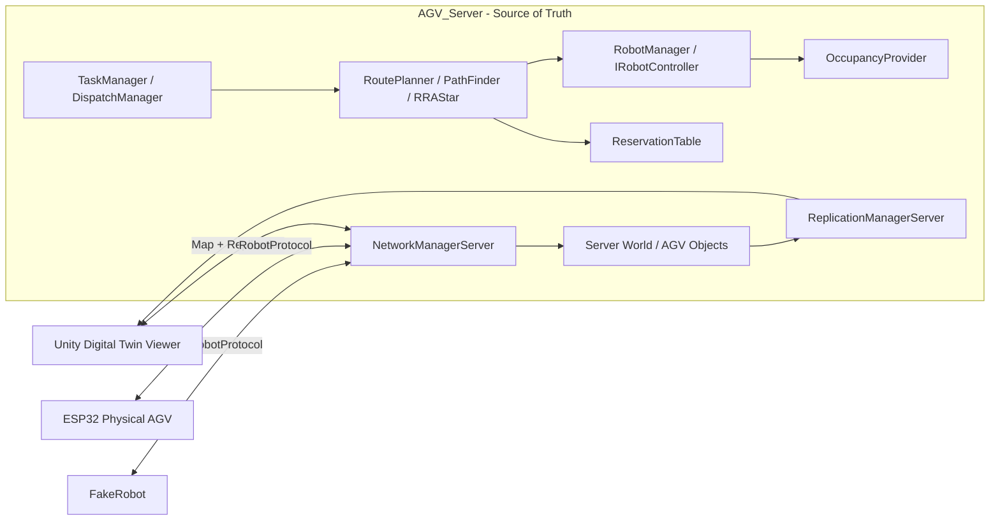

# System architecture

Last verified: 2026-08-07

Implementation base: `e193f64` (`old-new-combined`) plus the physical-demo working tree

## 한 문장 요약

이 시스템은 C++20/Linux 서버가 AGV world, 작업 배정, 시공간 경로와 예약을 소유하고 Unity viewer와 ESP32/FakeRobot client에 각각 상태와 경로를 전달하는 중앙 관제 구조다.



## 구성요소와 책임

| 구성요소 | 책임 | 하지 않는 일 |
|---|---|---|
| `NetworkManagerServer` | TCP client 수락, Unity/RobotProtocol 분기, world tick과 replication 조정 | 전용 TrafficControlManager 역할이 분리돼 있지는 않음 |
| `TaskManager` | IDLE, PICKUP, DROP 이벤트에 따라 다음 임무 요청 | 실제 경로 탐색 |
| `DispatchManager` | 가용 적재·하차 지점 선택 | node/edge 경로 생성 |
| `RoutePlanner` | 경로 수명주기, 예약 transaction, 재계획, controller 전달 | robot별 motor 제어 |
| `PathFinder` | 시간과 예약 충돌을 고려한 경로 후보 탐색 | 예약 확정 기록 |
| `RRAStar` | 목적지별 정적 거리 heuristic cache | 동적 예약 충돌 판단 |
| `ReservationTable` | 미래 node/edge/goal 시간 구간 예약 | 현재 물리 점유 상태의 단일 기준 |
| `OccupancyProvider` | 실행 시점의 실제 node/edge 점유 | 미래 route 계획 |
| `RobotManager` | AGV ID별 `IRobotController` 소유, 실행 안전 callback 주입 | route 자체 계산 |
| `UnityRobotController` | 서버 내부 `MovementSimulator` 실행 | Unity network viewer 자체 |
| `ESP32RobotController` | route/cancel 전송, STATUS/ARRIVED를 서버 controller interface로 변환 | ESP32의 저수준 motor 제어 |
| `ReplicationManagerServer` | 서버 object의 create/update 상태를 Unity로 전송 | route 명령 전송 |
| `EventManager` | frame 사이에서 task/route 이벤트 전달 | network packet framing |

## 프로세스 시작과 tick 흐름

```text
ServerMain
  -> runtime mode 선택 (기본 AutomaticFleet 또는 --physical-demo)
  -> TCP 0.0.0.0:6666 bind/listen
  -> ObjectRegistry 초기화
  -> NetworkManagerServer 초기화
     -> AutomaticFleet: map/warehouse/route/task 초기화, TESTCASE0 AGV 4대 생성
     -> PhysicalDemo: route 초기화, node 1의 AGV 1대 생성, 자동 task 비활성화
     -> UnityRobotController 등록
  -> select() 기반 loop
     -> accept/read packet
     -> UpdateWorld(deltaTime)
     -> SendOutgoingReplicationPackets()
```

현재 `_TESTCASE0`은 AGV 4대를 map node `1, 2, 3, 4`에서 시작시킨다. 이 값은 운영 설정 파일이 아니라 `Server/NetworkManagerServer.cpp`의 compile-time test 설정이다.

`--physical-demo`는 이 기본 world를 바꾸지 않는 별도 runtime mode다. 이 mode는 AGV 1의 RobotProtocol `HELLO` 이후 RoutePlanner를 통해 exact `[1 -> 2]` route만 만들며, 경로·예약·ARRIVED 수명주기를 그대로 사용한다. 목적은 motor-disabled 단일 실차 연동이다. Unity는 같은 server에 연결해 map과 AGV 1대의 상태를 렌더링할 수 있지만 route의 source of truth가 되지는 않는다.

## 임무에서 실행까지

```text
EventManager
  -> TaskManager
  -> DispatchManager
  -> RoutePlanner
  -> PathFinder + RRAStar
  -> ReservationTable transaction
  -> IRobotController::FollowRoute
     -> UnityRobotController 또는 ESP32RobotController
  -> STATUS / ARRIVED
  -> server AGV pose와 OccupancyProvider 갱신
  -> Unity replication
```

경로 계획은 고정 time-slot 논문 구현을 그대로 복제한 것이 아니다. WHCA*를 기반으로 float `TimeInterval`, node/양방향 edge/goal reservation과 실행 시점 occupancy를 함께 사용한다. 자세한 내용은 [WHCA* 코드 해설](whca-code-walkthrough.md)에 있다.

## 통신 경계

서버는 한 TCP 포트에서 두 protocol을 처리한다.

- Unity legacy protocol: session, map, object replication
- RobotProtocol v1: ESP32/FakeRobot의 HELLO, ROUTE, STATUS, ARRIVED, error/safety packet

TCP는 byte stream이므로 두 protocol 모두 frame 맨 앞의 `uint16 packetSize`로 메시지 경계를 구분한다. RobotProtocol의 상세 wire format은 [CommunicationProtocol.md](CommunicationProtocol.md)를 따른다.

## 물리 로봇 책임

서버가 보내는 것은 `FORWARD`, `PWM=120` 같은 지속적인 저수준 명령이 아니라 node route다. ESP32가 담당해야 하는 책임은 다음과 같다.

- route를 회전·직진·정지 단계로 변환
- encoder, odometry, PID와 motor driver 제어
- 연결이 끊겨도 local stop/safety 유지
- 실제 진행 상태와 도착을 `STATUS`, `ARRIVED`로 보고

현재는 실차 L자 주행 코드와 RobotProtocol 코드가 별도 계열이며, 통합 상태는 [physical-agv-integration.md](physical-agv-integration.md)를 참고한다.

## 현재 구조의 명시적 한계

- network loop는 `select()` 기반이며 생산 환경용 대규모 동시 접속 설계가 아니다.
- reconnect 시 이전 robot session 정리와 offline timeout 보강이 남아 있다.
- native Windows socket build는 지원하지 않는다. 서버는 Linux/WSL에서 빌드한다.
- Unity 프로젝트와 정식 ESP32 firmware 프로젝트가 이 저장소에 buildable source tree로 들어와 있지 않다.
- `TrafficControlManager`, WPF/HMI는 현재 구현이 아니다.
- 자동화된 unit/integration test target이 없다. FakeRobot 실행이 현재 대표 smoke test다.
