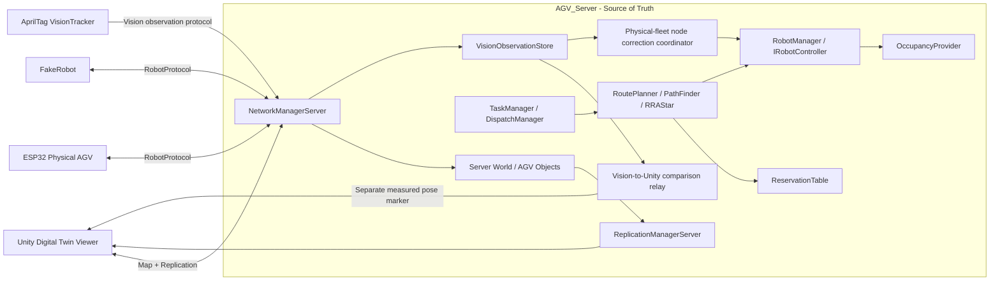

# System architecture

Last verified: 2026-08-31

Implementation base: `old-new-combined` 2026-08-25 working tree

## 한 문장 요약

이 시스템은 C++20/Linux 서버가 AGV world, 작업 배정, 시공간 경로와 예약을 소유하고 Unity viewer와 ESP32/FakeRobot client에 각각 상태와 경로를 전달하는 중앙 관제 구조다.



## 구성요소와 책임

| 구성요소 | 책임 | 하지 않는 일 |
|---|---|---|
| `NetworkManagerServer` | TCP client 수락, Unity/RobotProtocol 분기, world tick과 replication 조정 | 전용 TrafficControlManager 역할이 분리돼 있지는 않음 |
| `TaskManager` | IDLE, PICKUP, DROP 이벤트에 따라 다음 임무 요청 | 실제 경로 탐색 |
| `DispatchManager` | 가용 적재·하차 지점 선택 | node/edge 경로 생성 |
| `RoutePlanner` | 경로 수명주기, 예약 transaction, 재계획, controller 전달 | robot별 motor 제어 |
| `PathFinder` | 시간과 예약 충돌을 고려한 경로 후보 탐색 | 예약 확정 기록 |
| `RRAStar` | 목적지별 정적 거리 heuristic cache | 동적 예약 충돌 판단 |
| `ReservationTable` | 미래 node/edge/goal 시간 구간 예약 | 현재 물리 점유 상태의 단일 기준 |
| `OccupancyProvider` | 실행 시점의 실제 node/edge 점유 | 미래 route 계획 |
| `RobotManager` | AGV ID별 `IRobotController` 소유, 실행 안전 callback 주입 | route 자체 계산 |
| `UnityRobotController` | 서버 내부 `MovementSimulator` 실행 | Unity network viewer 자체 |
| `ESP32RobotController` | route/cancel 전송, STATUS/ARRIVED 변환, physical arrival commit과 departure hold/release 분리 | ESP32의 저수준 motor 제어 |
| `ReplicationManagerServer` | 서버 object의 create/update 상태를 Unity로 전송 | route 명령 전송 |
| `EventManager` | frame 사이에서 task/route 이벤트 전달 | network packet framing |
| `VisionObservationStore` | 검증된 최신 Vision 관측을 AGV별로 별도 저장 | AGV world pose 직접 덮어쓰기 또는 자체 경로 계획 |
| Vision-to-Unity comparison relay | fresh 관측을 map unit/radian으로 변환해 별도 `UPT_VISION_OBSERVATION` marker로 전송하고 timeout 시 LOST 전달 | 기존 replication AGV pose 또는 Server world 변경 |
| Physical-fleet node correction coordinator | coarse ARRIVED 뒤 node pose를 확정하고, 모든 다음 edge dispatch 전에 fresh Vision heading gate와 제한된 correction primitive를 순차 실행 | 주행 중 연속 steering, Vision pose로 예약·world pose 직접 변경, 무제한 재시도 |

## 프로세스 시작과 tick 흐름

```text
ServerMain
  -> runtime mode 선택 (기본 AutomaticFleet, --physical-fleet, --physical-demo,
     --trajectory-preview, --trajectory-raised-wheel)
  -> 독립 옵션 --vision-observation은 Vision receiver 활성화
     -> PhysicalFleet에서는 node 도착 보정 gate로도 사용
     -> 다른 mode에서는 비교 관측 저장·Unity relay만 수행
  -> 기본 TCP 0.0.0.0:6666 bind/listen (--listen으로 test endpoint 변경 가능)
  -> ObjectRegistry 초기화
  -> NetworkManagerServer 초기화
     -> AutomaticFleet: map/warehouse/route/task 초기화, TESTCASE0 AGV 4대 생성
     -> PhysicalFleet: node 1의 실제 AGV 1대, command HELLO 뒤 자동 배차
     -> PhysicalDemo: route 초기화, node 1의 AGV 1대 생성, 자동 task 비활성화
     -> TrajectoryPreview/RaisedWheel: node 1의 AGV 1대, 자동 task 비활성화
     -> UnityRobotController 등록
  -> select() 기반 loop
     -> accept/read packet
     -> UpdateWorld(deltaTime)
        -> PhysicalFleet coarse ARRIVED를 post-arrival 보정 완료 전까지 보류
        -> node/occupancy/route step을 한 번 확정하되 다음 edge는 departure hold
        -> 모든 route의 edge dispatch 전에 fresh MEASURED heading 정렬
        -> departure release 뒤에만 one-edge trajectory 전송, 실패 시 hold 상태로 fail-stop
     -> SendOutgoingReplicationPackets()
        -> 새 Vision sequence 또는 receive-timeout LOST 전환을 Unity에 별도 중계
```

현재 `_TESTCASE0`은 기본 automatic mode의 AGV 4대를 map node `1, 2, 3, 4`에서 시작시킨다. 이 값은 운영 설정 파일이 아니라 `Server/NetworkManagerServer.cpp`와 `Shared/DispatchManager.hpp`의 compile-time test 설정이다.

`--physical-demo`는 이 기본 world를 바꾸지 않는 별도 runtime mode다. 이 mode는 AGV 1의 RobotProtocol `HELLO` 이후 RoutePlanner를 통해 exact `[1 -> 2]` route만 만들며, 경로·예약·ARRIVED 수명주기를 그대로 사용한다. 목적은 motor-disabled 단일 실차 연동이다. Unity는 같은 server에 연결해 map과 AGV 1대의 상태를 렌더링할 수 있지만 route의 source of truth가 되지는 않는다.

`--trajectory-preview`는 실행 route가 아닌 통신 진단 mode다. preview-only capability인 AGV 1에 모든 target speed가 0인 `[1 -> 4]` trajectory를 한 번 보내고 RoutePlanner plan·예약·`ROUTE_COMMAND`·`ARRIVED`를 만들지 않는다.

## 임무에서 실행까지

```text
EventManager
  -> TaskManager
  -> DispatchManager
  -> RoutePlanner
  -> PathFinder + RRAStar
  -> ReservationTable transaction
  -> IRobotController::FollowRoute
     -> UnityRobotController 또는 ESP32RobotController
  -> STATUS / ARRIVED
  -> server AGV pose와 OccupancyProvider 갱신
  -> Unity replication
```

경로 계획은 고정 time-slot 논문 구현을 그대로 복제한 것이 아니다. WHCA*를 기반으로 float `TimeInterval`, node/양방향 edge/goal reservation과 실행 시점 occupancy를 함께 사용한다. 자세한 내용은 [WHCA* 코드 해설](whca-code-walkthrough.md)에 있다.

## 통신 경계

서버는 한 TCP 포트에서 세 protocol을 처리하며 최초 HELLO 뒤 client identity를 고정한다.

- Unity legacy protocol: session, map, object replication
- RobotProtocol v1: ESP32/FakeRobot의 HELLO, ROUTE, STATUS, ARRIVED, error/safety packet
- Vision observation protocol: source/session/좌표 계약 HELLO와 MEASURED/HELD/LOST 관측. 기본 OFF이며 명시적 옵션에서만 수신

TCP는 byte stream이므로 세 protocol 모두 frame 맨 앞의 `uint16 packetSize`로 메시지 경계를 구분한다. Robot/Vision wire format은 [CommunicationProtocol.md](CommunicationProtocol.md)를 따른다.

Vision 관측은 planned world pose 및 ESP32 상태와 별도로 저장된다. 기본 mode에서는 visualization 송신 단계만 store를 읽어 Unity의 별도 비교 marker packet을 만든다. 예외적으로 `PhysicalFleet + --vision-observation`에서는 node 도착 보정과 departure gate가 store를 읽는다. post-arrival의 fresh `MEASURED + VERIFIED` pose가 허용 범위에 들면 `NODE_ARRIVED`를 한 번 확정하지만 controller는 다음 edge를 hold한다. 별도의 pre-departure 검증이 성공한 뒤에만 hold를 해제하므로 task/route 전환이 일어나도 Vision pose가 AGV world pose나 예약을 직접 덮어쓰거나 조기 forward를 만들지 않는다.

## 물리 로봇 책임

서버가 보내는 것은 `FORWARD`, `PWM=120` 같은 지속적인 저수준 명령이 아니라 node route다. ESP32가 담당해야 하는 책임은 다음과 같다.

- route를 회전·직진·정지 단계로 변환
- encoder, odometry, PID와 motor driver 제어
- 연결이 끊겨도 local stop/safety 유지
- 실제 진행 상태와 도착을 `STATUS`, `ARRIVED`로 보고
- final one-edge 도착 뒤 Server가 보낸 제한된 correction primitive를 정지 상태에서 실행하고 결과를 보고

현재는 실차 L자 주행 코드와 RobotProtocol 코드가 별도 계열이며, 통합 상태는 [physical-agv-integration.md](physical-agv-integration.md)를 참고한다.

## 현재 구조의 명시적 한계

- network loop는 `select()` 기반이며 생산 환경용 대규모 동시 접속 설계가 아니다.
- Vision 관측의 Server→Unity 별도 비교 packet은 구현됐지만 실제 카메라·Unity 동시 실행 정확도는 아직 검증하지 않았다.
- Physical-fleet Vision node 보정은 Server build/CTest까지만 검증됐으며 새 firmware의 실차 primitive 실행은 아직 검증하지 않았다.
- native Windows socket build는 지원하지 않는다. 서버는 Linux/WSL에서 빌드한다.
- Unity 프로젝트와 정식 ESP32 firmware 프로젝트가 이 저장소에 buildable source tree로 들어와 있지 않다.
- `TrafficControlManager`, WPF/HMI는 현재 구현이 아니다.
- `TrajectorySmokeTest`, trajectory preview, `VisionObservationTest`, `PhysicalFleetCorrectionTest`, `PhysicalFleetDispatchStateTest`가 CTest에 등록돼 있다. 전체 fleet TCP E2E는 여전히 FakeRobot smoke test가 대표 검증이다.
