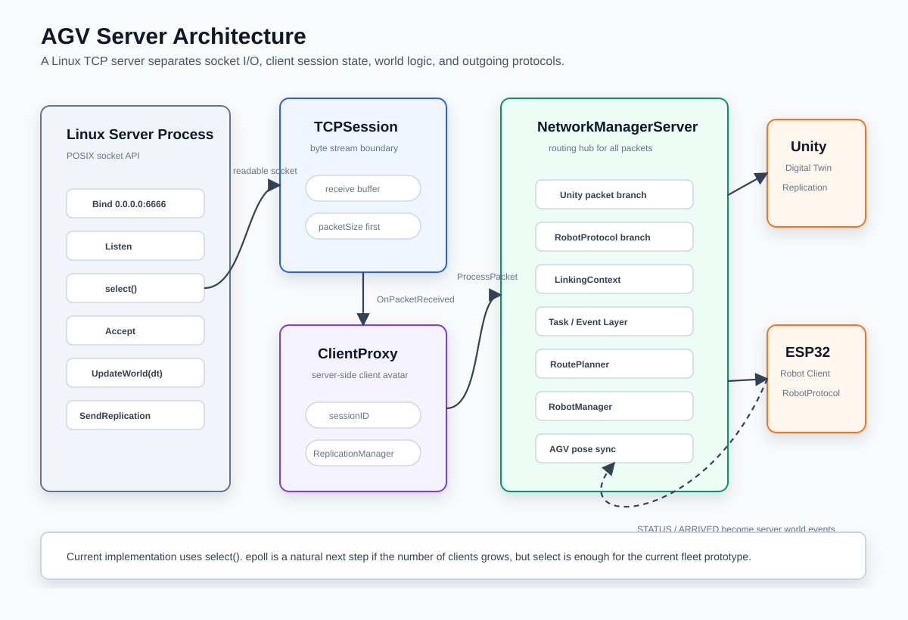

# [AGV 프로젝트] 네트워크 서버 구조부터 다시 보기 - Linux, select, ClientProxy, 그리고 Digital Twin

## 0. 들어가며

이 프로젝트에서 네트워크를 붙인 이유는 단순히 "Unity랑 서버를 연결하고 싶어서"가 아니었다.

처음에는 Unity에서 AGV를 움직이고, 서버가 적당히 좌표만 보내주는 구조도 생각할 수 있었다.  
하지만 실제로 다중 AGV 관제를 만들다 보니 핵심은 화면이 아니라 **서버가 world의 원본 상태를 가져야 한다는 것**이었다.

그래서 네트워크 구조를 다음 기준으로 잡았다.

```text
Server:
  AGV world, task, route, reservation의 원본

Unity:
  서버 상태를 보여주는 Digital Twin viewer

ESP32:
  실제 로봇의 motion과 sensor를 담당하는 robot client
```

이 글에서는 Replication이나 RobotProtocol로 들어가기 전에, 서버가 전체적으로 어떤 구조로 돌아가는지부터 정리한다.

## 1. 서버 전체 아키텍처

현재 서버 구조를 크게 보면 다음과 같다.



서버는 크게 네 층으로 나눌 수 있다.

```text
1. Socket Layer
   Bind / Listen / Accept / Send / Receive

2. Session Layer
   TCPSession, ClientProxy

3. Packet Routing Layer
   NetworkManagerServer

4. World Logic Layer
   TaskManager, RoutePlanner, ReservationTable, RobotManager
```

이렇게 나눈 이유는 간단하다.

소켓 코드는 byte를 주고받는 데만 집중해야 하고,  
AGV 경로 계획 코드는 socket fd 같은 것을 몰라야 한다.

## 2. 왜 Linux 서버인가

서버는 Linux 환경에서 돌리는 방향으로 잡았다.

이유는 다음과 같다.

- POSIX socket API를 직접 다루기 좋다.
- `select`, `poll`, `epoll` 같은 이벤트 기반 I/O 모델로 확장하기 좋다.
- 나중에 ROS, Docker, 실제 robot PC, Jetson 같은 환경으로 옮기기 쉽다.
- Unity는 Windows에서 실행하더라도, server는 독립 프로세스로 분리할 수 있다.
- WSL을 쓰면 Windows Unity와 Linux server를 동시에 테스트할 수 있다.

중요한 건 "Linux라서 무조건 좋다"가 아니다.  
이 프로젝트에서는 **관제 서버를 Unity 프로세스에서 분리하는 것**이 더 중요했다.

```text
Unity process:
  rendering, camera, visual debugging

Linux server process:
  networking, route planning, reservation, robot session
```

이렇게 분리해야 나중에 실제 ESP32가 붙어도 Unity를 서버처럼 억지로 쓰지 않아도 된다.

## 3. 왜 네트워크를 써야 했는가

디지털 트윈을 만든다고 해서 꼭 네트워크가 필요한 것은 아니다.  
Unity 안에서 모든 시뮬레이션을 돌리고 화면만 보여줄 수도 있다.

하지만 이 프로젝트의 목표는 단순 시뮬레이션이 아니었다.

```text
목표:
  Unity simulation에서 끝나는 것이 아니라
  실제 ESP32 AGV와 같은 서버에 연결되는 구조
```

그래서 처음부터 네트워크를 기준으로 나눴다.

```text
Server -> Unity:
  서버 world state를 시각화하기 위한 replication

Server <-> ESP32:
  실제 robot route 명령과 status 보고
```

이렇게 하면 Unity는 디지털 트윈 viewer가 되고, ESP32는 실제 로봇 client가 된다.

만약 Unity 내부에서만 AGV를 움직였다면, 실제 로봇이 들어오는 순간 구조를 크게 바꿔야 했을 것이다.

## 4. 서버 main loop

서버는 `0.0.0.0:6666`에 TCP socket을 열고 client 접속을 기다린다.

```cpp
SocketAddressPtr serverAddr =
    SocketAddressFactory::CreateIPv4FromString("0.0.0.0:6666");

TCPSocketPtr sockServerTcp =
    SocketUtil::CreateTCPSocket(AF_INET);

setsockopt(
    sockServerTcp->GetSocket(),
    SOL_SOCKET,
    SO_REUSEADDR,
    &option,
    sizeof(option));

sockServerTcp->Bind(*serverAddr);
sockServerTcp->Listen();
```

`0.0.0.0`으로 bind하면 localhost뿐 아니라 같은 네트워크의 다른 장치도 접근할 수 있다.  
ESP32가 WiFi를 통해 서버에 접속해야 하므로 이 점이 중요했다.

## 5. epoll인가 select인가

여기서 정확히 짚고 가야 한다.

현재 코드는 `epoll`이 아니라 `select()`를 사용한다.

```cpp
int toRet = SocketUtil::Select(
    &readBlockSockets,
    &readAbleSockets,
    nullptr,
    nullptr,
    nullptr,
    nullptr,
    &timeoutValue);
```

처음부터 epoll을 쓰지 않은 이유는 현재 단계에서 접속 수가 많지 않기 때문이다.

현재 client는 보통 다음 정도다.

- Unity 1개
- ESP32 1개
- FakeRobot 1개

이 정도 규모에서는 `select()`로도 충분히 구조를 검증할 수 있다.

다만 설계 방향은 이벤트 기반 I/O다.

```text
blocking receive를 client마다 기다리는 구조 X

select로 readable socket만 확인
  -> 새 접속이면 accept
  -> 기존 client면 ProcessIncomingData
```

나중에 AGV 수가 많아지면 `select()`는 `epoll`로 바꾸는 것이 자연스럽다.  
하지만 현재 포트폴리오 단계에서는 `select`를 통해 **이벤트 기반 서버 구조를 직접 구현했다**는 점이 더 중요하다.

## 6. select wrapper

`SocketUtil::Select()`는 vector에 들어 있는 socket들을 `fd_set`으로 바꾸고, select 결과를 다시 vector로 돌려준다.

```cpp
int SocketUtil::Select(
    const std::vector<TCPSocketPtr>* _inReadSet,
    std::vector<TCPSocketPtr>* _outReadSet,
    const std::vector<TCPSocketPtr>* _inWriteSet,
    std::vector<TCPSocketPtr>* _outWriteSet,
    const std::vector<TCPSocketPtr>* _inExceptSet,
    std::vector<TCPSocketPtr>* _outExceptSet,
    struct timeval* _timeOut)
{
    fd_set read, write, except;
    int nfds = 0;

    fd_set* readPtr =
        FileSetFromVector(read, _inReadSet, nfds);

    int result =
        select(nfds + 1, readPtr, nullptr, nullptr, _timeOut);

    if (result > 0)
    {
        FileVectorFromSet(_outReadSet, _inReadSet, read);
    }

    return result;
}
```

이 wrapper 덕분에 main loop에서는 low-level `FD_SET`, `FD_ISSET`을 직접 다루는 양이 줄었다.

## 7. 새 client가 접속하면

select 결과에서 server listen socket이 readable이면 새 client 접속이라는 뜻이다.

```cpp
if (socket == sockServerTcp)
{
    SocketAddress newClientAddr;
    TCPSocketPtr newClientSock =
        sockServerTcp->Accept(newClientAddr);

    if (newClientSock)
    {
        newSockets.push_back(newClientSock);
        NetworkManagerServer::sInstance
            ->OnClientAccepted(newClientSock);
    }
}
```

중요한 점은 listen socket과 client socket이 다르다는 것이다.

```text
listen socket:
  새 연결을 받는 문

client socket:
  실제 client와 데이터를 주고받는 통로
```

새 client socket이 생기면 서버는 이것을 `NetworkManagerServer::OnClientAccepted()`로 넘긴다.

## 8. ClientProxy란 무엇인가

`ClientProxy`는 서버 안에 존재하는 **client의 대리 객체**다.

클라이언트가 Unity인지 ESP32인지와 별개로, 일단 TCP로 연결된 상대를 서버 쪽에서 관리해야 한다.

```cpp
class ClientProxy
{
private:
    TCPSessionPtr m_TCPSession;
    uint32_t m_SessionID;
    ReplicationManagerServer m_ReplicationManagerServer;

public:
    void SetSessionID(uint32_t _sessionID);
    const uint32_t GetSessionID() const;
    void SendPacket(OutputMemoryStream& _inStream);
    TCPSessionPtr GetSession();
};
```

ClientProxy가 들고 있는 것은 크게 세 가지다.

```text
TCPSession:
  실제 TCP 송수신 담당

SessionID:
  Unity client session 구분용 ID

ReplicationManagerServer:
  이 client에게 보낼 object replication 장부
```

나는 ClientProxy를 "서버가 바라보는 client의 아바타"라고 생각했다.

## 9. TCPSession과 ClientProxy의 관계

새 client가 연결되면 서버는 `TCPSession`을 만들고, 그 session을 가진 `ClientProxy`를 만든다.

```cpp
void NetworkManagerServer::OnClientAccepted(TCPSocketPtr _tcpSocket)
{
    TCPSessionPtr newClientSession =
        std::make_shared<TCPSession>();

    newClientSession->SetSocket(_tcpSocket);

    ClientProxyPtr newClientProxy =
        std::make_shared<ClientProxy>(newClientSession, 0);

    m_PendingProxies.push_back(newClientProxy);
}
```

그리고 `ClientProxy` 생성자에서 packet callback을 연결한다.

```cpp
ClientProxy::ClientProxy(
    TCPSessionPtr _session,
    uint32_t _sessionID)
    : m_TCPSession(_session)
    , m_SessionID(_sessionID)
{
    m_TCPSession->OnPacketReceived =
        [this](InputMemoryStream& inStream)
        {
            NetworkManagerServer::sInstance
                ->ProcessPacket(this, inStream);
        };
}
```

이 구조가 중요한 이유는 `TCPSession`이 `NetworkManagerServer`를 직접 알 필요가 없기 때문이다.

```text
TCPSession:
  byte stream을 packet으로 자른다.

ClientProxy:
  이 packet이 어느 client에서 왔는지 알려준다.

NetworkManagerServer:
  packet 내용을 보고 실제 처리를 결정한다.
```

## 10. 데이터 수신 흐름

기존 client socket이 readable이면 서버는 해당 socket을 가진 ClientProxy를 찾고, 그 session의 `ProcessIncomingData()`를 호출한다.

```cpp
bool isAlive =
    currentClientPtr
        ->GetSession()
        ->ProcessIncomingData();

if (!isAlive)
{
    closedSockets.push_back(socket);
}
```

`TCPSession::ProcessIncomingData()`는 socket에서 byte를 읽고, 내부 receive buffer에 쌓는다.

```cpp
char buffer[1500];
int readBytesCount =
    m_Socket->Receive(buffer, sizeof(buffer));

m_ReceiveBuffer.insert(
    m_ReceiveBuffer.end(),
    buffer,
    buffer + readBytesCount);
```

그 다음 packet size를 기준으로 완성된 packet만 꺼낸다.

```cpp
if (m_ReceiveBuffer.size() < sizeof(uint16_t))
    break;

uint16_t packetSize =
    *reinterpret_cast<uint16_t*>(m_ReceiveBuffer.data());

if (m_ReceiveBuffer.size() < packetSize)
    break;

uint32_t payloadSize =
    packetSize - sizeof(uint16_t);

char* payloadStart =
    m_ReceiveBuffer.data() + sizeof(uint16_t);

InputMemoryStream inputStream(payloadStart, payloadSize);
OnPacketReceived(inputStream);
```

이 구조 때문에 packet이 반만 도착해도 안전하게 기다릴 수 있다.

## 11. Packet Routing

완성된 packet은 `NetworkManagerServer::ProcessPacket()`으로 들어온다.

```cpp
void NetworkManagerServer::ProcessPacket(
    ClientProxy* _session,
    InputMemoryStream& _inStream)
{
    if (TryProcessRobotProtocolPacket(_session, _inStream))
        return;

    uint8_t packet_type;
    _inStream.Read(packet_type);

    switch (packet_type)
    {
    case UPT_HELLO:
        HandleHello_Packet(_session, _inStream);
        break;

    case UPT_READY_MAP:
        HandleReadyMap_Packet(_session, _inStream);
        break;

    case UPT_READY_OBJECT:
        HandleReadyObject_Packet(_session, _inStream);
        break;

    default:
        printf("Invalid PacketData\n");
        break;
    }
}
```

여기서 먼저 `TryProcessRobotProtocolPacket()`을 호출한다.

이유는 서버 포트는 하나지만, 들어오는 client는 두 종류가 될 수 있기 때문이다.

```text
Unity client:
  UPT_HELLO, UPT_MAZE_DATA, UPT_REPLICATION

Robot client:
  HELLO, STATUS, ARRIVED, ERROR
```

즉 서버는 하나의 TCP accept loop를 사용하지만, packet header를 보고 Unity protocol과 RobotProtocol을 분기한다.

## 12. 서버 update loop와 dt

네트워크 서버라고 해서 packet만 처리하는 것은 아니다.  
AGV 관제 서버는 시간에 따라 world를 갱신해야 한다.

그래서 main loop에서 `deltaTime`을 계산한다.

```cpp
auto now = std::chrono::high_resolution_clock::now();

float deltaTime =
    std::chrono::duration<float>(now - lastUpdateTime).count();

lastUpdateTime = now;

if (deltaTime > 0.1f)
{
    deltaTime = 0.1f;
}

NetworkManagerServer::sInstance->UpdateWorld(deltaTime);
NetworkManagerServer::sInstance->SendOutgoingReplicationPackets();
```

`deltaTime`을 0.1초로 제한한 이유는 서버가 잠깐 멈췄다가 돌아왔을 때 world가 한 번에 너무 크게 튀는 것을 막기 위해서다.

`UpdateWorld()` 내부에서는 다음 순서로 처리한다.

```text
1. Robot controller event 수거
2. EventManager 처리
3. RoutePlanner update
4. RobotManager update
5. AGV pose를 server object에 반영
```

실제 코드도 이 레이어를 따라간다.

```cpp
void NetworkManagerServer::UpdateWorld(float _deltaTime)
{
    if (!m_IsSimulationActive)
        return;

    m_TotalElapsedServerTime += _deltaTime;

    // 1. INPUT layer
    for (auto it = RobotManager::GetInstance()
            .GetRobotControllers().begin();
         it != RobotManager::GetInstance()
            .GetRobotControllers().end();
         ++it)
    {
        while (it->second->HasEvent())
        {
            ControllerEvent ev = it->second->PopEvent();

            if (ev.type == ControllerEventType::ARRIVED)
            {
                EventManager::GetInstance().Publish({
                    RobotEventType::NODE_ARRIVED,
                    it->first,
                    m_TotalElapsedServerTime,
                    ev.nodeID
                });
            }
        }
    }

    // 2. LOGIC layer
    EventManager::GetInstance().SwapAndProcessEvents();
    RoutePlanner::GetInstance()
        .Update(_deltaTime, m_TotalElapsedServerTime);

    // 3. EXECUTION layer
    RobotManager::GetInstance()
        .Update(_deltaTime, m_TotalElapsedServerTime);

    // 4. VISUALIZATION sync
    for (auto it = RobotManager::GetInstance()
            .GetRobotControllers().begin();
         it != RobotManager::GetInstance()
            .GetRobotControllers().end();
         ++it)
    {
        StatusPacket status = it->second->GetStatus();
        ObjectPtr obj = m_LinkingContext->GetObject(it->first);

        if (Robo* agv = dynamic_cast<Robo*>(obj.get()))
        {
            agv->SetPos(status.x, status.z);
            agv->SetHeadingAngle(status.heading);
        }
    }
}
```

이 흐름 때문에 ESP32에서 `STATUS`가 들어오면 서버 object가 갱신되고, 그 결과가 다시 Unity replication으로 나간다.

## 13. 왜 ROS를 바로 쓰지 않았는가

ROS를 쓰면 많은 기능을 이미 제공받을 수 있다.

- topic 기반 pub/sub
- node 분리
- sensor message
- robot ecosystem
- RViz 같은 visualization 도구

그런데 이 프로젝트에서는 처음부터 ROS를 쓰지 않았다.

이유는 ROS가 나빠서가 아니다.  
이번 프로젝트의 핵심 목표가 달랐기 때문이다.

```text
이번 프로젝트의 목표:
  직접 fleet server 구조를 만들고
  TCP packet protocol을 설계하고
  Unity Digital Twin과 ESP32를 연결하는 것
```

ROS를 바로 쓰면 통신 구조의 많은 부분을 framework가 대신해준다.  
하지만 나는 서버가 어떤 식으로 client를 받고, packet을 자르고, object를 복제하고, robot status를 world state로 반영하는지 직접 구현해보고 싶었다.

또 ESP32는 작은 MCU라서 PC/ROS 노드처럼 무겁게 다루기 어렵다.  
현재 단계에서는 ESP32가 단순한 TCP client로 붙는 구조가 더 직접적이었다.

그래서 선택은 이렇게 정리할 수 있다.

```text
ROS:
  실제 로봇 생태계와 sensor integration에 강함

Custom TCP server:
  내 프로젝트의 fleet logic, protocol 설계, Unity 연동 구조를 직접 보여주기 좋음
```

나중에 프로젝트가 커지면 ROS2 bridge를 붙이는 것도 가능하다.  
하지만 현재 포트폴리오 단계에서는 custom server/protocol이 프로젝트의 핵심 역량을 더 잘 보여준다.

## 14. 현재 구조의 한계

현재 구현은 완성형 산업 서버가 아니다.

한계도 있다.

- `select()` 기반이라 client 수가 매우 많아지면 비효율적이다.
- socket write가 항상 한 번에 전송된다고 가정하는 부분은 보강이 필요하다.
- packet endian 처리가 명시적이지 않다.
- Unity protocol과 RobotProtocol이 한 포트에서 공존하므로 초기 packet 판별 규칙을 더 엄격히 만들 수 있다.
- disconnect 이후 RobotSession 정리 정책이 더 필요하다.

하지만 현재 단계에서는 이 구조가 충분히 의미 있다.

왜냐하면 아직 차체가 도착하기 전에도 다음을 검증했기 때문이다.

- Linux TCP server accept loop
- Unity connection
- packet size framing
- ClientProxy 기반 session 관리
- Server world update loop
- Unity replication
- ESP32/FakeRobot robot protocol branch

## 15. 정리

이번 글의 핵심은 다음과 같다.

```text
ServerMain:
  socket accept와 select 기반 event loop

TCPSession:
  TCP byte stream을 packet 단위로 복원

ClientProxy:
  서버 안에서 client connection을 대표하는 객체

NetworkManagerServer:
  Unity protocol과 RobotProtocol을 분기하고 world update를 수행

World Logic:
  Task, Route, Reservation, Robot status를 처리

Unity / ESP32:
  서버에 붙는 서로 다른 역할의 client
```

이 구조가 먼저 잡혔기 때문에 이후 글에서 설명할 Replication과 RobotProtocol이 자연스럽게 이어진다.

다음 글에서는 이 서버 구조 위에서 **Unity Digital Twin을 위해 왜 Replication을 사용했는지** 정리한다.
