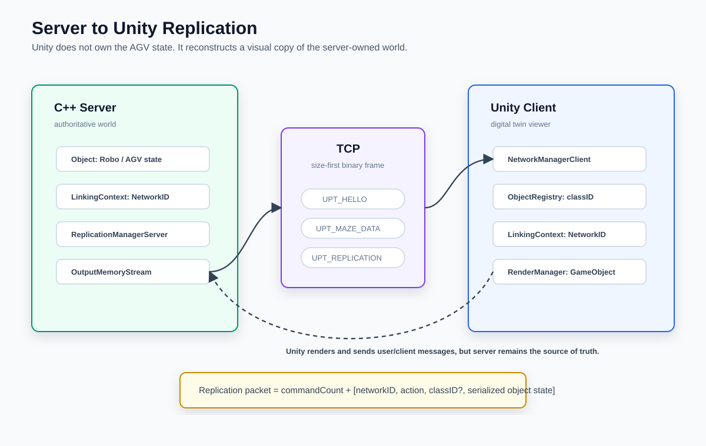

# [AGV 프로젝트] C++ 서버와 Unity를 TCP로 연결하기 - 왜 Replication을 썼는가

## 0. 들어가며

처음에는 단순하게 생각했다.

> 서버에서 AGV 좌표를 보내고, Unity에서 그 좌표대로 움직이면 되지 않을까?

하지만 실제로 구현하다 보니 문제가 조금 달랐다.

Unity는 화면을 보여주는 데 강하고, C++ 서버는 경로 계획과 다중 AGV 상태 관리에 강하다.  
그렇다면 둘 중 누가 AGV의 "진짜 상태"를 가지고 있어야 할까?

이 프로젝트에서는 서버가 정답이라고 판단했다.

그래서 네트워크 구조의 첫 번째 목표는 다음과 같았다.

> Server가 AGV world의 원본 상태를 가지고, Unity는 그 상태를 복제해서 보여준다.

이때 사용한 구조가 **Replication**이다.

## 1. 처음 문제

AGV가 하나만 있으면 좌표 하나만 보내도 된다.

```text
AGV 1 position = (10, 0, 20)
```

하지만 실제 프로젝트에서는 AGV가 여러 대이고, 각각의 상태가 계속 바뀐다.

- AGV가 새로 생성될 수 있음
- AGV의 위치와 회전이 계속 바뀜
- 나중에는 장애물, 작업 지점, 충전소 같은 object도 생길 수 있음
- Unity와 Server가 같은 object를 같은 ID로 알아야 함

그래서 단순히 `x, z, heading`만 계속 보내는 방식으로는 부족했다.

## 2. 내가 선택한 구조

전체 흐름은 다음과 같다.



핵심은 Server와 Unity가 object를 직접 공유하지 않는다는 점이다.  
두 프로그램은 서로 다른 프로세스이고, 서로 다른 언어를 쓴다.

그래서 Server는 object 상태를 byte stream으로 직렬화해서 보내고, Unity는 그 데이터를 읽어서 자기 쪽 GameObject를 만든다.

```text
Server Object
    -> Serialize
    -> TCP Packet
    -> Unity Deserialize
    -> GameObject 생성/갱신
```

## 3. 짚고 넘어갈 개념: Replication

Replication은 말 그대로 **복제**다.

게임 서버에서 자주 쓰는 방식인데, 서버가 원본 world state를 가지고 있고 클라이언트는 그 상태를 복제해서 화면에 보여준다.

여기서 중요한 것은 Unity가 원본이 아니라는 점이다.

```text
Server: 진짜 AGV 상태를 소유
Unity : 서버 상태를 받아서 시각화
```

이렇게 하면 좋은 점이 있다.

- 경로 계획 결과가 Server 기준으로 일관된다.
- Unity가 꺼졌다 켜져도 Server world는 유지된다.
- 나중에 ESP32 실제 로봇이 붙어도 Server 구조를 그대로 사용할 수 있다.
- Unity는 디지털 트윈 viewer 역할에 집중할 수 있다.

## 4. TCP는 메시지를 보장하지 않는다

여기서 먼저 해결해야 했던 문제가 있었다.

TCP는 데이터를 순서대로 보내주지만, **내가 보낸 단위 그대로 받게 해주지는 않는다.**

예를 들어 서버가 이렇게 보냈다고 하자.

```text
Packet A: 100 bytes
Packet B: 100 bytes
Packet C: 100 bytes
```

받는 쪽에서는 이렇게 올 수도 있다.

```text
300 bytes 한 번에 도착
```

또는 이렇게 올 수도 있다.

```text
30 bytes
70 bytes
120 bytes
80 bytes
```

그래서 패킷 앞에 항상 **전체 패킷 크기**를 붙였다.


```text
+----------------+----------------------+
| uint16 size    | packet body          |
+----------------+----------------------+
```

서버 쪽 `TCPSession::SendPacket()`은 실제 전송 전에 size를 붙인다.

```cpp
void TCPSession::SendPacket(OutputMemoryStream& _inStream)
{
    uint16_t total_size =
        static_cast<uint16_t>(sizeof(uint16_t)) + _inStream.GetLength();

    OutputMemoryStream finalStream;
    finalStream.Write(total_size);
    finalStream.Write(_inStream.GetBuffer(), _inStream.GetLength());

    m_Socket->Send(finalStream.GetBuffer(), finalStream.GetLength());
}
```

반대로 받을 때는 먼저 2바이트를 읽고, 그 크기만큼 데이터가 쌓일 때까지 기다린다.

```cpp
uint16_t packetSize =
    *reinterpret_cast<uint16_t*>(m_ReceiveBuffer.data());

if (m_ReceiveBuffer.size() < packetSize)
{
    break;
}

uint32_t payloadSize = packetSize - sizeof(uint16_t);
char* payloadStart = m_ReceiveBuffer.data() + sizeof(uint16_t);

InputMemoryStream inputStream(payloadStart, payloadSize);
OnPacketReceived(inputStream);
```

이 구조 덕분에 서버와 Unity는 같은 규칙으로 패킷 경계를 찾을 수 있다.

Unity protocol의 body는 `uint8_t packetType`으로 시작한다.  
RobotProtocol이 `packetID + agvID + sequence`를 공통 header로 갖는 것과 달리, Unity protocol은 화면 동기화에 필요한 `UPT_HELLO`, `UPT_MAZE_DATA`, `UPT_REPLICATION` 같은 packet type만 먼저 구분한다.

## 5. PacketType을 나눈 이유

Unity와 Server 사이에는 여러 종류의 메시지가 오간다.

```cpp
enum UnityPacketType : uint8_t
{
    UPT_REPLICATION = 0,
    UPT_MAZE_DATA = 1,
    UPT_HELLO = 2,
    UPT_DISCONNECTED = 3,
    UPT_READY_MAP = 4,
    UPT_READY_OBJECT = 5
};
```

여기서 중요한 건 3개다.

```text
UPT_HELLO       : Unity 접속 확인
UPT_MAZE_DATA   : 맵 노드/링크 전송
UPT_REPLICATION : object 생성/갱신/삭제
```

처음 연결되면 Unity는 서버에 붙고, 서버는 session ID와 map data를 보내준다.

```cpp
void NetworkManagerServer::HandleHello_Packet(
    ClientProxy* _proxy,
    InputMemoryStream& _instream)
{
    uint32_t newClientSessionID = nextSessionID;

    m_SessionIdToProxyMap[newClientSessionID] = _proxy;
    _proxy->SetSessionID(newClientSessionID);
    nextSessionID++;

    for (auto& obj : m_LinkingContext->GetAllObjects())
    {
        uint32_t existingNetworkID = obj.first;
        _proxy->GetReplicationManagerServer().ReplicateCreate(existingNetworkID);
    }

    SendHello_Packet(_proxy);
    SendMap_Packet(_proxy);
}
```

여기서 눈여겨볼 부분은 새 Unity 클라이언트가 들어오면 기존 object들을 `ReplicateCreate()`로 등록한다는 점이다.

즉 Unity가 나중에 접속해도 서버에 이미 존재하는 AGV들을 다시 생성할 수 있다.

## 6. NetworkID가 필요한 이유

서버와 Unity는 같은 메모리를 공유하지 않는다.

서버 입장에서 AGV 객체 주소가 `0x1234`라고 해도 Unity에서는 아무 의미가 없다.  
그래서 양쪽에서 공통으로 사용할 ID가 필요했다.

이 프로젝트에서는 그것을 `NetworkID`로 관리한다.

```text
Server Robo object  -> NetworkID 1
Unity GameObject    -> NetworkID 1
```

이렇게 맞춰두면 서버가 나중에 이렇게 말할 수 있다.

```text
NetworkID 1번 object 위치를 (10, 20)으로 바꿔라
```

Unity는 자기 dictionary에서 `NetworkID 1`에 해당하는 GameObject를 찾아 위치를 갱신한다.

## 7. ReplicationManagerServer

ReplicationManagerServer는 쉽게 말하면 **전송할 변경 사항 장부**다.

```cpp
enum ReplicationAction : uint8_t
{
    RT_CREATE,
    RT_UPDATE,
    RT_DESTORY,
    MAX
};
```

각 object마다 어떤 action을 보낼지 기록한다.

- `RT_CREATE`: Unity 쪽에 GameObject를 새로 만들어라
- `RT_UPDATE`: 이미 있는 GameObject 상태를 갱신해라
- `RT_DESTORY`: 삭제해라

실제 전송할 때는 다음처럼 command count를 먼저 쓰고, object별 명령을 이어서 쓴다.

```cpp
void ReplicationManagerServer::Write(OutputMemoryStream& _outStream)
{
    if (m_Commands.empty())
        return;

    uint32_t commandCount = m_Commands.size();
    _outStream.Write(commandCount);

    for (auto& com : m_Commands)
    {
        uint32_t networkID = com.first;
        ReplicationAction action = com.second;

        _outStream.Write(networkID);
        _outStream.Write(static_cast<uint8_t>(action));

        if (action == RT_CREATE)
        {
            ObjectPtr obj =
                NetworkManagerServer::sInstance
                    ->GetLinkingContext()
                    ->GetObject(networkID);

            _outStream.Write(obj->GetClassID());
            obj->Write(_outStream);
        }
        else if (action == RT_UPDATE)
        {
            ObjectPtr obj =
                NetworkManagerServer::sInstance
                    ->GetLinkingContext()
                    ->GetObject(networkID);

            obj->Write(_outStream);
        }
    }
}
```

`RT_CREATE`에는 `classID`가 필요하다.  
Unity가 어떤 prefab을 만들어야 하는지 알아야 하기 때문이다.

반대로 `RT_UPDATE`에서는 이미 object가 있으므로 `classID` 없이 상태만 보내면 된다.

## 8. Object serialization

모든 object는 자기 상태를 stream에 쓸 수 있어야 한다.

현재 기본 object는 위치와 heading을 보낸다.

```cpp
void Object::Write(OutputMemoryStream& _outStream)
{
    _outStream.Write(GetPosX());
    _outStream.Write(GetPosZ());
    _outStream.Write(m_HeadingAngle);
}
```

Unity는 같은 순서로 읽는다.

```text
float posX
float posZ
float heading
```

이때 중요한 것은 **쓰기 순서와 읽기 순서가 반드시 같아야 한다**는 점이다.

```text
Server Write: x -> z -> heading
Unity Read : x -> z -> heading
```

이 순서가 한 번이라도 어긋나면 그 뒤 데이터가 전부 밀린다.  
그래서 네트워크 프로토콜에서는 "대충 읽기"가 통하지 않는다.

## 9. 서버는 언제 replication packet을 보내는가

서버 main loop에서는 world를 갱신하고, 그 결과를 Unity로 보낸다.

```cpp
NetworkManagerServer::sInstance->UpdateWorld(deltaTime);
NetworkManagerServer::sInstance->SendOutgoingReplicationPackets();
```

`SendOutgoingReplicationPackets()`에서는 각 Unity session별로 replication packet을 만든다.

```cpp
void NetworkManagerServer::SendOutgoingReplicationPackets()
{
    for (auto iter = m_SessionIdToProxyMap.begin();
         iter != m_SessionIdToProxyMap.end();
         iter++)
    {
        ClientProxy* proxy = iter->second;

        OutputMemoryStream replicateStream;
        replicateStream.Write(static_cast<uint8_t>(UPT_REPLICATION));

        proxy->GetReplicationManagerServer().Write(replicateStream);

        if (replicateStream.GetLength() > sizeof(uint8_t))
        {
            proxy->SendPacket(replicateStream);
        }
    }
}
```

비어 있는 replication은 보내지 않는다.  
즉 변경 사항이 있을 때만 packet이 나간다.

## 10. Unity는 어떻게 받는가

Unity 쪽에서도 똑같이 먼저 packet size를 읽는다.

```csharp
ushort packetSize = BitConverter.ToUInt16(m_SizeBuffer, 0);

byte[] bodyBuffer = new byte[packetSize - 2];
int totalRead = 0;

while (totalRead < bodyBuffer.Length)
{
    int bytesRead =
        m_Stream.Read(bodyBuffer, totalRead, bodyBuffer.Length - totalRead);

    totalRead += bytesRead;
}

InputMemoryStream inputStream = new InputMemoryStream(bodyBuffer);
onPacketReceived?.Invoke(inputStream);
```

그리고 packet type에 따라 처리한다.

```csharp
public void ProcessPacket(InputMemoryStream _inStream)
{
    PACKET_TYPE packet_type = (PACKET_TYPE)_inStream.ReadByte();

    switch (packet_type)
    {
        case PACKET_TYPE.PT_HELLO:
            HandleHelloPacket_Recv(_inStream);
            break;

        case PACKET_TYPE.PT_MAZE_DATA:
            HandleMapDataPacket_Recv(_inStream);
            break;

        case PACKET_TYPE.PT_REPLICATION:
            HandleReplicatePacket_Recv(_inStream);
            break;
    }
}
```

Replication packet이 오면 action별로 object를 만들거나 갱신한다.

```csharp
public void HandleReplicatePacket_Recv(InputMemoryStream _inStream)
{
    UInt32 commandCount = _inStream.ReadUInt32();

    for (int i = 0; i < commandCount; i++)
    {
        UInt32 networkID = _inStream.ReadUInt32();
        REPLICATION_ACTION action =
            (REPLICATION_ACTION)_inStream.ReadByte();

        switch (action)
        {
            case REPLICATION_ACTION.RT_CREATE:
            {
                UInt32 classID = _inStream.ReadUInt32();

                Object obj = ObjectRegistry.Instance.CreateObject(classID);
                m_LinkingContext.AddObject(networkID, obj);

                obj.Read(_inStream);

                m_NetworkEventQueue.Enqueue(
                    new NetworkSpawnEvent(networkID, classID));
                break;
            }

            case REPLICATION_ACTION.RT_UPDATE:
            {
                Object obj = m_LinkingContext.GetObject(networkID);
                obj.Read(_inStream);

                Vector2 pos = new Vector2(obj.m_PosX, obj.m_PosY);
                float headingAngle = obj.m_HeadingAngle;

                m_NetworkEventQueue.Enqueue(
                    new NetworkUpdateEvent(networkID, pos, headingAngle));
                break;
            }
        }
    }
}
```

Unity는 여기서 바로 GameObject를 만지지 않고 event queue에 넣는다.  
Unity object 조작은 main thread에서 처리하는 쪽이 안전하기 때문이다.

## 11. RenderManager

마지막으로 RenderManager가 `NetworkID`에 맞는 GameObject를 찾아 위치를 갱신한다.

```csharp
public void UpdateObjectPosition(
    UInt32 _networkID,
    Vector2 _position,
    float _rot)
{
    if (m_NetworkIDToGameObjectMap.ContainsKey(_networkID))
    {
        m_NetworkIDToGameObjectMap[_networkID].transform.position =
            new Vector3(_position.x, 0.0f, _position.y);

        float angleDeg = _rot * Mathf.Rad2Deg;
        angleDeg = -angleDeg + 90f;

        Quaternion targetRot = Quaternion.Euler(0f, angleDeg, 0f);
        m_NetworkIDToGameObjectMap[_networkID].transform.rotation = targetRot;
    }
}
```

이렇게 해서 서버의 AGV 상태가 Unity 화면에 반영된다.

## 12. 정리

이번 네트워크 구조의 핵심은 다음과 같다.

```text
Server
  - AGV 상태의 원본
  - NetworkID 발급
  - Object serialization
  - Replication command 생성

TCP
  - size-first frame
  - packet type 기반 분기

Unity
  - packet deserialize
  - NetworkID로 GameObject 매핑
  - RenderManager로 위치/회전 반영
```

처음에는 단순히 Unity와 서버를 연결하는 것이 목표였지만, 구현하면서 중요한 기준이 생겼다.

> Unity가 움직임을 결정하는 것이 아니라, 서버 상태를 Unity가 복제해서 보여준다.

이 구조 덕분에 나중에 ESP32 실제 로봇을 붙일 때도 Unity를 버릴 필요가 없었다.  
Unity는 계속 디지털 트윈 viewer로 남고, 실제 로봇은 별도의 robot protocol로 서버에 붙이면 된다.

다음 글에서는 이 구조를 확장해서 **ESP32를 실제 AGV client로 붙이기 위해 RobotProtocol을 어떻게 분리했는지** 정리해보겠다.
