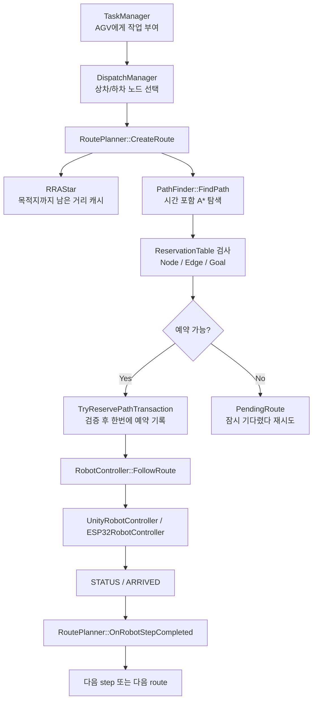

# WHCA* 구현 코드 해설

이 문서는 현재 프로젝트의 WHCA* 계열 경로 계획 코드를 아주 천천히 설명한다.  
목표는 "논문 알고리즘 이름은 아는데 코드에서 어디가 뭔지 모르겠다" 상태를 벗어나는 것이다.

비유부터 잡고 가자.

> 여러 AGV가 좁은 창고에서 움직인다.  
> 한 길을 두 대가 동시에 쓰면 충돌한다.  
> 그러니까 서버는 "너는 10.0초부터 11.2초까지 12번 노드 사용", "너는 11.2초부터 12.1초까지 12->13 링크 사용" 같은 예약표를 만들어야 한다.

이 프로젝트의 핵심은 다음 한 문장이다.

> A*로 길을 찾되, 노드와 링크를 시간 구간 단위로 예약해서 다른 AGV와 겹치지 않는 경로만 선택한다.

---

## 1. 전체 흐름

먼저 큰 그림부터 보자.



각 파일의 역할은 다음과 같다.

| 파일 | 역할 |
|---|---|
| `Shared/Map.*` | 노드와 링크를 로드한다. WHCA*가 움직일 그래프다. |
| `Shared/ReservationTable.hpp` | "언제 어떤 노드/링크가 예약되어 있는가"를 저장한다. |
| `Shared/RRAstar.*` | 목적지까지 남은 정적 거리 캐시를 만든다. A* 휴리스틱이다. |
| `Shared/PathFinder.*` | 시간과 예약표를 보면서 실제 경로를 찾는다. |
| `Server/RoutePlanner.*` | PathFinder 결과를 검증하고 예약표에 확정 기록한다. |
| `Server/TaskManager.*` | AGV가 놀고 있으면 새 작업을 준다. |
| `Shared/OccupancyProvider.hpp` | 실제 현재 점유 상태를 관리한다. 예약표와는 다르다. |
| `Shared/MovementSimulator.*` | Unity/FakeRobot용 실제 움직임 시뮬레이터다. |

---

## 2. 이 구현은 정확히 어떤 WHCA*인가

논문 WHCA*는 보통 `(node, time slot)` 형태를 많이 쓴다.

예를 들면:

```text
Node 12, TimeSlot 10
Node 12, TimeSlot 11
Node 13, TimeSlot 12
```

그런데 네 코드는 이걸 그대로 쓰지 않는다.

네 코드는 `TimeInterval`을 쓴다.

```cpp
struct TimeInterval 
{
    float start;
    float end;
    uint32_t agvID;
    ReservationType type;

    bool Overlaps(float s, float e) const
    {
        return !(e <= start || s >= end);
    }
};
```

위 코드는 [Shared/ReservationTable.hpp](/home/hwang-juhyun/FinalProject/AGV_FleetControlSystem/Shared/ReservationTable.hpp:155)에 있다.

뜻은 아주 단순하다.

```text
이 AGV가
start초부터 end초까지
어떤 노드 또는 링크를 사용한다.
```

예:

```text
AGV 1: Node 12를 10.0초 ~ 11.3초까지 사용
AGV 2: Node 12를 10.8초 ~ 12.0초까지 사용
```

이 둘은 시간이 겹친다. 그래서 충돌이다.

`Overlaps()`는 이렇게 판단한다.

```cpp
return !(e <= start || s >= end);
```

풀어 쓰면:

```text
새 구간이 기존 구간보다 완전히 앞에 있거나
새 구간이 기존 구간보다 완전히 뒤에 있으면
안 겹친다.

그 외에는 겹친다.
```

---

## 3. 지도 구조: WHCA*가 움직일 그래프

WHCA*는 지도 위에서 동작한다.  
여기서 지도는 Unity 이미지가 아니라 그래프다.

```cpp
struct MapNode
{
    uint32_t m_Id;
    float m_PosX;
    float m_PosZ;
    uint8_t type;
};
```

[Shared/Map.hpp](/home/hwang-juhyun/FinalProject/AGV_FleetControlSystem/Shared/Map.hpp:7)

노드는 "AGV가 지나가거나 멈출 수 있는 지점"이다.

```cpp
struct MapLink
{
    uint32_t m_Id;
    uint32_t m_FromNodeID;
    uint32_t m_ToNodeID;
    uint8_t m_Type;
    bool m_IsBlocked = false;
    float m_Dist;
    float m_CX1;
    float m_CZ1;
    float m_CX2;
    float m_CZ2;
};
```

[Shared/Map.hpp](/home/hwang-juhyun/FinalProject/AGV_FleetControlSystem/Shared/Map.hpp:18)

링크는 "노드와 노드 사이의 길"이다.

중요한 필드:

- `m_FromNodeID`: 출발 노드
- `m_ToNodeID`: 도착 노드
- `m_Type`: 직선인지 곡선인지
- `m_IsBlocked`: 막힌 길인지
- `m_Dist`: 링크 길이
- `m_CX1`, `m_CZ1`, `m_CX2`, `m_CZ2`: 곡선 베지어 제어점

MapData는 JSON에서 로드된다.

```cpp
node.m_Id = nodeItem["id"].get<uint32_t>();
node.m_PosX = nodeItem["x"].get<float>();
node.m_PosZ = nodeItem["z"].get<float>();
```

[Shared/Map.cpp](/home/hwang-juhyun/FinalProject/AGV_FleetControlSystem/Shared/Map.cpp:49)

링크도 JSON에서 로드된다.

```cpp
link.m_FromNodeID = linkItem["from"].get<uint32_t>();
link.m_ToNodeID = linkItem["to"].get<uint32_t>();
link.m_Type = linkItem.value("type", 0);
link.m_Dist = linkItem.value("dist", 0.0f);
```

[Shared/Map.cpp](/home/hwang-juhyun/FinalProject/AGV_FleetControlSystem/Shared/Map.cpp:63)

즉 PathFinder는 Unity 화면을 보지 않는다.  
PathFinder는 `MapNode`, `MapLink`로 된 그래프만 본다.

---

## 4. ReservationTable: 예약 장부

ReservationTable은 두 장부를 가진다.

```cpp
std::unordered_map<uint32_t, std::vector<TimeInterval>> m_NodeReservations;
std::unordered_map<uint64_t, std::vector<TimeInterval>> m_EdgeReservations;
```

[Shared/ReservationTable.hpp](/home/hwang-juhyun/FinalProject/AGV_FleetControlSystem/Shared/ReservationTable.hpp:171)

뜻:

```text
m_NodeReservations:
  NodeID -> 이 노드를 누가 언제 쓰는지 목록

m_EdgeReservations:
  EdgeKey -> 이 링크를 누가 언제 쓰는지 목록
```

### 4.1 Node 예약

노드가 비어있는지 확인하는 함수:

```cpp
bool IsNodeFree(uint32_t nodeID, float start, float end, uint32_t ignoreAgvID)
```

[Shared/ReservationTable.hpp](/home/hwang-juhyun/FinalProject/AGV_FleetControlSystem/Shared/ReservationTable.hpp:178)

핵심 코드:

```cpp
for (const auto& interval : it->second)
{
    if (interval.agvID == _ignoreAgvID) continue;
    if (interval.Overlaps(_startTime, _endTime)) return false;
}
return true;
```

뜻:

```text
이 노드에 이미 예약이 없으면 true.
예약이 있으면 하나씩 본다.
내 AGV가 한 예약이면 무시한다.
다른 AGV 예약과 시간이 겹치면 false.
끝까지 안 겹치면 true.
```

`ignoreAgvID`가 왜 필요하냐면, AGV가 자기 경로를 다시 계획할 때 자기 기존 예약과 충돌하면 안 되기 때문이다.

### 4.2 Edge 예약

링크 예약은 Node 예약과 비슷하다.

```cpp
bool IsEdgeFree(uint32_t from, uint32_t to, float start, float end, uint32_t ignoreAgvID)
```

[Shared/ReservationTable.hpp](/home/hwang-juhyun/FinalProject/AGV_FleetControlSystem/Shared/ReservationTable.hpp:188)

단, 링크는 `from`, `to` 두 노드로 key를 만든다.

```cpp
inline uint64_t MakeEdgeKey(uint32_t from, uint32_t to) 
{
    uint32_t minNode = std::min(from, to);
    uint32_t maxNode = std::max(from, to);
    return (static_cast<uint64_t>(minNode) << 32) | static_cast<uint64_t>(maxNode);
}
```

[Shared/ReservationTable.hpp](/home/hwang-juhyun/FinalProject/AGV_FleetControlSystem/Shared/ReservationTable.hpp:161)

여기가 정말 중요하다.

`MakeEdgeKey(12, 13)`과 `MakeEdgeKey(13, 12)`는 같은 값이 된다.

왜?

```text
from/to 방향을 버리고
작은 노드 ID, 큰 노드 ID 순서로 key를 만들기 때문
```

그래서 이런 충돌을 막는다.

```text
AGV A: 12 -> 13
AGV B: 13 -> 12
```

둘은 서로 마주보고 달린다.  
노드만 예약하면 못 잡을 수 있다.  
Edge 예약을 방향 없이 잡으면 같은 통로를 동시에 못 쓰게 된다.

### 4.3 예약 기록

노드 예약:

```cpp
void ReserveNode(uint32_t nodeID, float start, float end, uint32_t agvID, ReservationType type)
```

[Shared/ReservationTable.hpp](/home/hwang-juhyun/FinalProject/AGV_FleetControlSystem/Shared/ReservationTable.hpp:199)

하는 일:

```text
1. 해당 노드의 interval 목록을 가져온다.
2. 이미 같은 AGV가 비슷한 start로 예약했다면 중복 기록하지 않는다.
3. 새 TimeInterval을 push_back 한다.
4. start 시간 기준으로 정렬한다.
```

Edge 예약도 동일한 방식이다.

---

## 5. Goal Reservation: 목적지는 오래 잡아둔다

AGV는 목적지에 도착하자마자 사라지는 물체가 아니다.

상차하면 잠시 머문다.  
하차해도 잠시 머문다.  
Home에 가도 그 노드를 점유한다.

그래서 목적지는 일반 노드보다 오래 예약해야 한다.

코드에서는 `ReservationType`이 있다.

```cpp
enum class ReservationType { Normal, Goal };
```

[Shared/ReservationTable.hpp](/home/hwang-juhyun/FinalProject/AGV_FleetControlSystem/Shared/ReservationTable.hpp:153)

그리고 RoutePlanner에서 목적지이면 오래 예약한다.

```cpp
const float LONG_TERM_HORIZON = WINDOW_TIME * 3.0f;
```

[Server/RoutePlanner.cpp](/home/hwang-juhyun/FinalProject/AGV_FleetControlSystem/Server/RoutePlanner.cpp:16)

현재 `WINDOW_TIME = 16`이므로:

```text
LONG_TERM_HORIZON = 48초
```

예약할 때:

```cpp
bool reachedGoal = (cur.nodeID == _finalTargetID);
float nodeLeaveTime =
    reachedGoal
        ? cur.arrivalTime + LONG_TERM_HORIZON
        : cur.departureTime + TIME_MARGIN;
```

[Server/RoutePlanner.cpp](/home/hwang-juhyun/FinalProject/AGV_FleetControlSystem/Server/RoutePlanner.cpp:157)

뜻:

```text
일반 경유 노드:
  도착 후 잠깐만 점유

진짜 목적지 노드:
  오래 점유
```

이게 없으면 이런 문제가 생긴다.

```text
AGV 1이 하차지 5에 도착해서 하차 중
AGV 2가 "어? 5번 노드 비었네?" 하고 같은 곳으로 들어옴
```

Goal Reservation은 이걸 막는다.

---

## 6. RRA*: 목적지까지 남은 거리 캐시

PathFinder는 A*를 쓴다.  
A*는 `f = g + h`를 쓴다.

```text
g = 지금까지 실제로 쓴 비용
h = 목적지까지 대충 얼마나 남았는지
f = 전체 예상 비용
```

여기서 `h`를 잘 계산해야 A*가 똑똑하게 움직인다.

네 코드는 `h`를 RRA*로 구한다.

### 6.1 RRAStar 구조

```cpp
struct RRANode 
{
    uint32_t id;
    float g;
    float h;
    float f;
};
```

[Shared/RRAstar.hpp](/home/hwang-juhyun/FinalProject/AGV_FleetControlSystem/Shared/RRAstar.hpp:9)

현재 구현에서는 `h`는 거의 쓰지 않고, 목적지에서 퍼지는 Dijkstra 캐시처럼 동작한다.

```cpp
m_OpenList.push(RRANode(m_GoalNodeID, 0.0f, 0.0f));
```

[Shared/RRAstar.cpp](/home/hwang-juhyun/FinalProject/AGV_FleetControlSystem/Shared/RRAstar.cpp:16)

뜻:

```text
목적지 노드는 목적지까지 거리 0이다.
거기서부터 주변 노드로 거리를 퍼뜨린다.
```

### 6.2 왜 Reverse인가

일반적으로는 시작점에서 목적지로 탐색한다.

RRA*는 반대로 생각한다.

```text
목적지에서 시작해서
모든 노드까지의 거리를 캐시한다.
```

그러면 여러 AGV가 같은 목적지를 향할 때 이득이다.

```text
AGV 1 -> 목적지 12
AGV 2 -> 목적지 12
AGV 3 -> 목적지 12
```

목적지가 같으면 RRA 캐시를 재사용할 수 있다.

RoutePlanner가 목적지별로 RRAStar를 저장한다.

```cpp
std::unordered_map<uint32_t, RRAStar> m_RRAEngines;
```

[Server/RoutePlanner.hpp](/home/hwang-juhyun/FinalProject/AGV_FleetControlSystem/Server/RoutePlanner.hpp:61)

목적지가 처음 나오면 초기화한다.

```cpp
if (m_RRAEngines.find(_targetNodeID) == m_RRAEngines.end())
    m_RRAEngines[_targetNodeID].Init(_targetNodeID);
```

[Server/RoutePlanner.cpp](/home/hwang-juhyun/FinalProject/AGV_FleetControlSystem/Server/RoutePlanner.cpp:242)

### 6.3 GetAbstractDistance

PathFinder가 물어본다.

```text
"이 노드에서 목적지까지 얼마나 멀어?"
```

RRAStar가 답한다.

```cpp
float RRAStar::GetAbstractDistance(uint32_t nodeID)
```

[Shared/RRAstar.cpp](/home/hwang-juhyun/FinalProject/AGV_FleetControlSystem/Shared/RRAstar.cpp:19)

먼저 캐시를 본다.

```cpp
if (m_ClosedList.find(_nodeID) != m_ClosedList.end())
{
    return m_ClosedList[_nodeID];
}
```

이미 계산했으면 바로 반환한다.

모르면 open list를 계속 확장한다.

```cpp
while (!m_OpenList.empty())
{
    RRANode current = m_OpenList.top();
    m_OpenList.pop();
    ...
}
```

확정된 거리는 `m_ClosedList`에 넣는다.

```cpp
m_ClosedList[current.id] = current.g;
```

주변 노드로 확장한다.

```cpp
float distToNeighbor = CalculateHeuristic(current.id, neighborID);
float nextG = current.g + distToNeighbor;
m_OpenList.push(RRANode(neighborID, nextG, 0.f));
```

현재 구현의 RRA*는 예약표를 보지 않는다.  
다른 AGV도 보지 않는다.

오직 정적 맵만 보고:

```text
목적지까지 대략 얼마나 남았는가
```

만 알려준다.

### 6.4 PathFinder에서 쓰는 방식

PathFinder에서는 이렇게 쓴다.

```cpp
startNode->h =
    _rraEngine.GetAbstractDistance(_startNodeID) / AGVKinematics::MAX_SPEED;
```

[Shared/PathFinder.cpp](/home/hwang-juhyun/FinalProject/AGV_FleetControlSystem/Shared/PathFinder.cpp:53)

거리 / 최대속도 = 예상 시간이다.

즉:

```text
h = 목적지까지 남은 예상 시간
```

---

## 7. PathFinder: 시간까지 포함한 A*

이제 핵심이다.

```cpp
std::vector<PathStep> PathFinder::FindPath(
    uint32_t startNodeID,
    uint32_t targetNodeID,
    uint32_t agvID,
    float startTime,
    float windowTimeLimit,
    RRAStar& rraEngine)
```

[Shared/PathFinder.cpp](/home/hwang-juhyun/FinalProject/AGV_FleetControlSystem/Shared/PathFinder.cpp:31)

이 함수는 이렇게 말하는 것이다.

```text
AGV agvID가
startTime부터
startNodeID에서 출발해서
targetNodeID로 가고 싶다.

예약표를 보면서
windowTimeLimit 안에서
갈 수 있는 경로를 찾아라.
```

### 7.1 PathStep

결과 경로는 `PathStep` 배열이다.

```cpp
struct PathStep
{
    uint32_t nodeID;
    float arrivalTime;
    float departureTime;
};
```

[Shared/PathFinder.hpp](/home/hwang-juhyun/FinalProject/AGV_FleetControlSystem/Shared/PathFinder.hpp:8)

뜻:

```text
nodeID에 arrivalTime에 도착하고
departureTime에 떠난다.
```

예:

```text
Node 1: 0.0 도착, 0.0 출발
Node 2: 1.4 도착, 1.4 출발
Node 3: 2.9 도착, 4.0 출발
```

Node 3에서 `arrivalTime != departureTime`이면 그 노드에서 기다린 것이다.

### 7.2 AStarNode

탐색 중에는 `AStarNode`를 쓴다.

```cpp
struct AStarNode
{
    uint32_t id;
    float g;
    float h;
    float f;
    float arrivalTime;
    float departureTime;
    std::shared_ptr<AStarNode> parentNode;
};
```

[Shared/PathFinder.hpp](/home/hwang-juhyun/FinalProject/AGV_FleetControlSystem/Shared/PathFinder.hpp:16)

중요한 점:

```text
같은 Node 5라도
10.0초에 있는 Node 5와
12.0초에 있는 Node 5는 다른 상태다.
```

그래서 이 구현은 "공간 A*"가 아니라 "시공간 A*"다.

### 7.3 TimeSpaceKey

시공간 상태를 구분하기 위해 key를 만든다.

```cpp
inline std::string GenerateTimeSpaceKey(uint32_t nodeID, float time)
{
    int timeSlot = static_cast<int>(std::round(time * 10.0f)); 
    return std::to_string(nodeID) + "_" + std::to_string(timeSlot);
}
```

[Shared/PathFinder.cpp](/home/hwang-juhyun/FinalProject/AGV_FleetControlSystem/Shared/PathFinder.cpp:17)

여기서 시간에 `* 10`을 한다.

뜻:

```text
0.1초 단위로 key를 만든다.
```

예:

```text
node 5, time 1.23초 -> round(12.3) -> 12 -> "5_12"
node 5, time 1.25초 -> round(12.5) -> 13 -> "5_13"
```

예약표 자체는 float interval이지만, A*의 closed/open key는 0.1초 단위로 묶는다.

---

## 8. PathFinder 시작

출발지와 목적지가 같으면 바로 끝낸다.

```cpp
if (_startNodeID == _targetNodeID)
{
    finalPath.push_back({_startNodeID, _startTime, _startTime + 18.0f});
    return finalPath;
}
```

[Shared/PathFinder.cpp](/home/hwang-juhyun/FinalProject/AGV_FleetControlSystem/Shared/PathFinder.cpp:36)

뜻:

```text
이미 목적지면 움직일 필요 없다.
대신 그 노드에 일정 시간 머무르는 step을 만든다.
```

그 다음 open list를 만든다.

```cpp
std::priority_queue<..., ...> openList(...);
```

[Shared/PathFinder.cpp](/home/hwang-juhyun/FinalProject/AGV_FleetControlSystem/Shared/PathFinder.cpp:42)

open list는 "아직 탐색해야 할 후보"다.  
`f`가 작은 후보가 먼저 나온다.

출발 노드를 넣는다.

```cpp
auto startNode = std::make_shared<AStarNode>(_startNodeID);
startNode->arrivalTime = _startTime;
startNode->departureTime = _startTime;
startNode->g = 0.f;
startNode->h = _rraEngine.GetAbstractDistance(_startNodeID) / AGVKinematics::MAX_SPEED;
startNode->f = startNode->g + startNode->h;
```

[Shared/PathFinder.cpp](/home/hwang-juhyun/FinalProject/AGV_FleetControlSystem/Shared/PathFinder.cpp:49)

처음에는:

```text
출발 노드에 startTime에 이미 있다.
지금까지 비용 g = 0.
남은 예상 비용 h = RRA 거리 / 최고 속도.
f = g + h.
```

---

## 9. PathFinder 메인 루프

메인 루프:

```cpp
while (!openList.empty())
{
    auto current = openList.top();
    openList.pop();
    ...
}
```

[Shared/PathFinder.cpp](/home/hwang-juhyun/FinalProject/AGV_FleetControlSystem/Shared/PathFinder.cpp:65)

매번 가장 좋아 보이는 후보를 꺼낸다.

꺼낸 후보를 closed에 넣는다.

```cpp
std::string currentKey = GenerateTimeSpaceKey(current->id, current->departureTime);
if (closedList.find(currentKey) != closedList.end()) continue;
closedList[currentKey] = current;
```

[Shared/PathFinder.cpp](/home/hwang-juhyun/FinalProject/AGV_FleetControlSystem/Shared/PathFinder.cpp:71)

뜻:

```text
이 노드 + 이 시간대는 이미 처리했으면 패스.
처음이면 처리 완료 목록에 넣는다.
```

목적지에 도착하면 끝낸다.

```cpp
if (current->id == _targetNodeID)
{
    endNode = current;
    break;
}
```

[Shared/PathFinder.cpp](/home/hwang-juhyun/FinalProject/AGV_FleetControlSystem/Shared/PathFinder.cpp:76)

윈도우 시간이 끝나도 멈춘다.

```cpp
if (current->departureTime - _startTime >= _windowTimeLimit)
{
    endNode = current;
    break;
}
```

[Shared/PathFinder.cpp](/home/hwang-juhyun/FinalProject/AGV_FleetControlSystem/Shared/PathFinder.cpp:82)

이게 WHCA*의 window 개념이다.

```text
끝까지 한 번에 못 가도 된다.
일단 window 안에서 갈 수 있는 만큼 계획한다.
나중에 다시 계획한다.
```

---

## 10. 행동 1: WAIT

AGV가 할 수 있는 행동은 크게 두 가지다.

```text
1. 현재 노드에서 기다리기
2. 다음 노드로 이동하기
```

WAIT부터 보자.

```cpp
const float WAIT_TIME = 1.0f;
float waitLeaveTime = current->departureTime + WAIT_TIME;
```

[Shared/PathFinder.cpp](/home/hwang-juhyun/FinalProject/AGV_FleetControlSystem/Shared/PathFinder.cpp:12)

1초 기다리는 후보를 만든다.

하지만 아무 때나 기다릴 수 없다.  
내가 기다리는 동안 그 노드를 다른 AGV가 예약했으면 안 된다.

```cpp
if (ReservationTable::GetInstance().IsNodeFree(
        current->id,
        current->arrivalTime,
        waitLeaveTime + CLEARANCE_TIME,
        _agvID))
```

[Shared/PathFinder.cpp](/home/hwang-juhyun/FinalProject/AGV_FleetControlSystem/Shared/PathFinder.cpp:95)

뜻:

```text
현재 노드를
처음 도착한 시간부터
기다린 뒤 조금 여유 시간까지
다른 AGV가 쓰지 않는가?
```

비어있으면 waitNode를 만든다.

```cpp
waitNode->id = current->id;
waitNode->arrivalTime = current->arrivalTime;
waitNode->departureTime = waitLeaveTime;
waitNode->g = current->g + WAIT_TIME;
```

[Shared/PathFinder.cpp](/home/hwang-juhyun/FinalProject/AGV_FleetControlSystem/Shared/PathFinder.cpp:102)

핵심은 이것이다.

```text
노드는 그대로다.
시간만 1초 뒤로 간다.
```

AGV가 "가만히 서서 시간만 보내는" 행동이다.

---

## 11. 행동 2: MOVE

이제 이동이다.

```cpp
for (const auto& link : links)
{
    if (link.m_FromNodeID != current->id || link.m_IsBlocked) continue;
    uint32_t neighborID = link.m_ToNodeID;
    ...
}
```

[Shared/PathFinder.cpp](/home/hwang-juhyun/FinalProject/AGV_FleetControlSystem/Shared/PathFinder.cpp:118)

뜻:

```text
현재 노드에서 출발하는 링크만 본다.
막힌 링크는 무시한다.
```

주의:

```text
여기서는 link.m_FromNodeID == current->id 인 링크만 쓴다.
즉 PathFinder는 방향 그래프처럼 움직인다.
```

RRAStar는 양방향처럼 거리를 확장하지만, 실제 이동 PathFinder는 from->to 방향을 따른다.

### 11.1 cycle 방지

```cpp
bool isCycle = false;
auto traceNode = current;
while (traceNode != nullptr)
{
    if (traceNode->id == neighborID)
    {
        isCycle = true;
        break;
    }
    traceNode = traceNode->parentNode;
}
if (isCycle) continue;
```

[Shared/PathFinder.cpp](/home/hwang-juhyun/FinalProject/AGV_FleetControlSystem/Shared/PathFinder.cpp:124)

뜻:

```text
이미 지나온 노드로 다시 돌아가는 후보는 버린다.
```

예:

```text
1 -> 2 -> 3 -> 2
```

이런 루프를 막는다.

### 11.2 이동 시간 계산

거리:

```cpp
float dist =
    (link.m_Type == 1)
        ? link.m_Dist
        : sqrt(...)
```

[Shared/PathFinder.cpp](/home/hwang-juhyun/FinalProject/AGV_FleetControlSystem/Shared/PathFinder.cpp:140)

곡선 링크면 Unity에서 계산된 `m_Dist`를 쓴다.  
직선이면 두 노드 좌표 사이 유클리드 거리로 계산한다.

이동 시간:

```cpp
float travelTime =
    turnTime + AGVKinematics::EstimateStopToStopTravelTime(dist);
```

[Shared/PathFinder.cpp](/home/hwang-juhyun/FinalProject/AGV_FleetControlSystem/Shared/PathFinder.cpp:152)

여기서 단순히 `거리 / 속도`가 아니다.

AGV는:

```text
멈춘 상태에서 출발
가속
이동
감속
도착지에서 정지
```

한다고 본다.

`EstimateStopToStopTravelTime()`은 이걸 계산한다.

```cpp
constexpr float MAX_SPEED = 4.0f;
constexpr float MAX_ACCEL = 6.0f;
constexpr float MAX_DECEL = 6.0f;
```

[Shared/AGVKinematics.hpp](/home/hwang-juhyun/FinalProject/AGV_FleetControlSystem/Shared/AGVKinematics.hpp:8)

거리가 충분히 길면:

```text
가속 시간 + 최고속도 주행 시간 + 감속 시간
```

거리가 짧으면:

```text
최고속도까지 못 가고 삼각형 속도 프로파일
```

이 방식이 그냥 `dist / speed`보다 현실적이다.

### 11.3 회전 시간 계산

이전 이동 방향과 다음 이동 방향이 다르면 회전 시간이 필요하다.

```cpp
if (auto previousMovingNode = FindPreviousMovingNode(current))
{
    ...
    const float previousHeading = BezierFollower::Heading(...);
    const float nextHeading = BezierFollower::Heading(...);
    const float turnAngle = abs(NormalizeAngle(nextHeading - previousHeading));
    turnTime = EstimateTurnInPlaceTime(turnAngle) * (1.0f - HeadingSpeedScale(turnAngle));
}
```

[Shared/PathFinder.cpp](/home/hwang-juhyun/FinalProject/AGV_FleetControlSystem/Shared/PathFinder.cpp:142)

어렵게 보이지만 의미는 이거다.

```text
이전 길에서 바라보던 방향과
다음 길에서 바라봐야 할 방향이 많이 다르면
회전 시간도 비용에 넣는다.
```

그래서 직선 경로만 무조건 좋아하지 않고, 급격한 회전이 많은 경로는 더 비싸게 본다.

### 11.4 Edge 예약 검사

이동 시작/끝 시간:

```cpp
float enterTime = current->departureTime;
float leaveTime = enterTime + travelTime;
```

[Shared/PathFinder.cpp](/home/hwang-juhyun/FinalProject/AGV_FleetControlSystem/Shared/PathFinder.cpp:153)

링크가 비었는지 검사:

```cpp
if (!ReservationTable::GetInstance().IsEdgeFree(
        current->id,
        neighborID,
        enterTime,
        leaveTime + CLEARANCE_TIME,
        _agvID))
    continue;
```

[Shared/PathFinder.cpp](/home/hwang-juhyun/FinalProject/AGV_FleetControlSystem/Shared/PathFinder.cpp:159)

뜻:

```text
current -> neighbor 링크를
enterTime부터 leaveTime + 여유시간까지
다른 AGV가 쓰지 않는가?
```

비어있지 않으면 그 경로 후보는 버린다.

### 11.5 도착 노드 예약 검사

```cpp
float requiredDwellTime =
    (neighborID == _targetNodeID)
        ? LONG_TERM_HORIZON
        : CLEARANCE_TIME;
```

[Shared/PathFinder.cpp](/home/hwang-juhyun/FinalProject/AGV_FleetControlSystem/Shared/PathFinder.cpp:161)

도착 노드가 목적지면 오래 비어 있어야 한다.  
경유 노드면 잠깐만 비어 있으면 된다.

```cpp
if (!ReservationTable::GetInstance().IsNodeFree(
        neighborID,
        leaveTime,
        leaveTime + requiredDwellTime,
        _agvID))
    continue;
```

[Shared/PathFinder.cpp](/home/hwang-juhyun/FinalProject/AGV_FleetControlSystem/Shared/PathFinder.cpp:163)

비어 있으면 후보 노드를 만든다.

```cpp
neighborNode->arrivalTime = leaveTime;
neighborNode->departureTime = leaveTime;
neighborNode->g = current->g + travelTime;
neighborNode->h = rraDistance / MAX_SPEED;
neighborNode->f = g + h;
```

[Shared/PathFinder.cpp](/home/hwang-juhyun/FinalProject/AGV_FleetControlSystem/Shared/PathFinder.cpp:169)

---

## 12. Path trace: 최종 경로 만들기

탐색이 끝나면 `endNode`에서 parent를 따라 거꾸로 올라간다.

```cpp
while (trace != nullptr)
{
    rawTrace.push_back(trace);
    trace = trace->parentNode;
}
std::reverse(rawTrace.begin(), rawTrace.end());
```

[Shared/PathFinder.cpp](/home/hwang-juhyun/FinalProject/AGV_FleetControlSystem/Shared/PathFinder.cpp:185)

그 다음 같은 노드에서 기다린 기록을 하나로 합친다.

```cpp
if (rawTrace[i]->id == currentStep.nodeID)
{
    currentStep.departureTime = rawTrace[i]->departureTime;
}
```

[Shared/PathFinder.cpp](/home/hwang-juhyun/FinalProject/AGV_FleetControlSystem/Shared/PathFinder.cpp:203)

예:

```text
rawTrace:
  Node 5, arrive 10, depart 10
  Node 5, arrive 10, depart 11
  Node 5, arrive 10, depart 12

finalPath:
  Node 5, arrive 10, depart 12
```

즉 WAIT 여러 개를 하나의 PathStep으로 압축한다.

---

## 13. RoutePlanner: 경로를 예약표에 확정하는 곳

PathFinder는 "가능해 보이는 경로"를 찾는다.  
하지만 실제 예약표에 쓰는 건 RoutePlanner다.

진입점:

```cpp
void RoutePlanner::CreateRoute(uint32_t agvID, uint32_t targetNodeID, float serverTime, MissionPurpose purpose)
```

[Server/RoutePlanner.cpp](/home/hwang-juhyun/FinalProject/AGV_FleetControlSystem/Server/RoutePlanner.cpp:203)

흐름:

```cpp
if (TryFindPath(...))
{
    if (TryReservePathTransaction(...))
        HandlePathFound(...);
    else
        HandlePathFailed(...);
}
else
{
    HandlePathFailed(...);
}
```

[Server/RoutePlanner.cpp](/home/hwang-juhyun/FinalProject/AGV_FleetControlSystem/Server/RoutePlanner.cpp:221)

뜻:

```text
1. 길을 찾아본다.
2. 찾은 길을 진짜 예약표에 써도 되는지 다시 검사한다.
3. 괜찮으면 확정한다.
4. 안 되면 잠깐 기다렸다가 다시 시도한다.
```

---

## 14. TryFindPath: RRAStar + PathFinder 연결

```cpp
bool RoutePlanner::TryFindPath(...)
{
    uint32_t curNodeID = AGVManager::GetInstance().FindAGV(_agvID)->GetCurrentNodeID();

    if (m_RRAEngines.find(_targetNodeID) == m_RRAEngines.end())
        m_RRAEngines[_targetNodeID].Init(_targetNodeID);

    PathFinder pf;
    outPath = pf.FindPath(curNodeID, _targetNodeID, _agvID, _serverTime, WINDOW_TIME, m_RRAEngines[_targetNodeID]);

    return (!outPath.empty() && outPath.size() >= 2);
}
```

[Server/RoutePlanner.cpp](/home/hwang-juhyun/FinalProject/AGV_FleetControlSystem/Server/RoutePlanner.cpp:239)

이 함수는:

```text
AGV의 현재 노드를 찾고
목적지용 RRAStar 캐시를 준비하고
PathFinder에게 길을 찾아달라고 한다.
```

`outPath.size() >= 2`인 이유:

```text
출발 노드만 있으면 이동 명령이 아니다.
최소한 출발 노드와 다음 노드가 있어야 route가 된다.
```

---

## 15. TryReservePathTransaction: 가장 중요한 함수

이 함수가 진짜 장부 기록 담당이다.

```cpp
bool RoutePlanner::TryReservePathTransaction(
    uint32_t agvID,
    const std::vector<PathStep>& path,
    uint32_t finalTargetID,
    float serverTime)
```

[Server/RoutePlanner.cpp](/home/hwang-juhyun/FinalProject/AGV_FleetControlSystem/Server/RoutePlanner.cpp:123)

이름에 `Transaction`이 붙은 이유가 중요하다.

```text
검사하다가 중간에 일부만 예약하면 안 된다.

전체 경로가 다 가능한지 먼저 검사하고
가능하면 그때 한 번에 기록한다.
```

### 15.1 즉시 출발이면 실시간 점유도 검사

```cpp
if (_path.size() >= 2 && _path[0].departureTime <= _serverTime + 0.05f)
{
    ...
    if (occ.IsNodeOccupiedByOther(nextNodeID, _agvID)) return false;
    if (occ.IsEdgeOccupiedByOther(firstEdgeKey, _agvID)) return false;
}
```

[Server/RoutePlanner.cpp](/home/hwang-juhyun/FinalProject/AGV_FleetControlSystem/Server/RoutePlanner.cpp:135)

예약표는 계획이고, OccupancyProvider는 실제 현재 점유다.

예:

```text
예약표상으로는 비어있어 보이는데,
실제로 어떤 AGV가 아직 그 노드/링크에 있을 수 있다.
```

그래서 바로 출발하는 경우에는 현재 점유도 본다.

### 15.2 검증 루프

먼저 검증만 한다.

```cpp
for (size_t i = 0; i < _path.size(); i++)
{
    ...
    if (!resTable.IsNodeFree(...)) return false;
    if (!resTable.IsEdgeFree(...)) return false;
}
```

[Server/RoutePlanner.cpp](/home/hwang-juhyun/FinalProject/AGV_FleetControlSystem/Server/RoutePlanner.cpp:152)

여기서는 아직 예약표에 쓰지 않는다.  
그냥 "다 가능한가?"만 본다.

### 15.3 기록 전에 기존 미래 예약 제거

```cpp
resTable.OverrideFutureReservations(_agvID, _serverTime, CLEARANCE_TIME);
```

[Server/RoutePlanner.cpp](/home/hwang-juhyun/FinalProject/AGV_FleetControlSystem/Server/RoutePlanner.cpp:175)

AGV가 새 route를 받으면, 예전 route의 미래 예약이 남아있으면 안 된다.

예:

```text
AGV 1의 예전 계획:
  10초에 Node 5
  12초에 Node 6

새 계획:
  10초에 Node 8
```

예전 예약을 안 지우면 다른 AGV가 Node 5, 6을 못 쓰게 된다.

`OverrideFutureReservations()`는:

```text
serverTime + safetyMargin 이후의 내 예약을 제거하거나 잘라낸다.
```

### 15.4 기록 루프

검증이 끝났으면 이제 진짜 기록한다.

```cpp
resTable.ReserveNode(cur.nodeID, cur.arrivalTime, nodeLeaveTime, _agvID, nodeType);
```

[Server/RoutePlanner.cpp](/home/hwang-juhyun/FinalProject/AGV_FleetControlSystem/Server/RoutePlanner.cpp:192)

그리고 다음 노드가 있으면 edge도 예약한다.

```cpp
resTable.ReserveEdge(
    cur.nodeID,
    next.nodeID,
    cur.departureTime,
    next.arrivalTime + TIME_MARGIN,
    _agvID,
    ReservationType::Normal);
```

[Server/RoutePlanner.cpp](/home/hwang-juhyun/FinalProject/AGV_FleetControlSystem/Server/RoutePlanner.cpp:197)

---

## 16. HandlePathFound: 경로를 로봇에게 보낸다

예약이 성공하면:

```cpp
HandlePathFound(...)
```

[Server/RoutePlanner.cpp](/home/hwang-juhyun/FinalProject/AGV_FleetControlSystem/Server/RoutePlanner.cpp:250)

여기서 중앙 계획표에 저장한다.

```cpp
RoutePlan plan;
plan.agvID = _agvID;
plan.currentStepIndex = 1;
plan.purpose = _purpose;
plan.finalTargetNodeID = _targetNodeID;
plan.steps = path;
m_MasterPlans[_agvID] = plan;
```

뜻:

```text
서버가 이 AGV의 현재 route 계획을 기억한다.
```

그 다음 로봇 상태를 MOVING으로 바꾼다.

```cpp
agv->ChangeState(AGVState::MOVING);
```

그리고 `PathStep`을 `RouteNodeTime`으로 바꿔서 controller에게 보낸다.

```cpp
for (const auto& step : path)
{
    routeNodes.push_back({step.nodeID, step.arrivalTime, step.departureTime});
}
```

[Server/RoutePlanner.cpp](/home/hwang-juhyun/FinalProject/AGV_FleetControlSystem/Server/RoutePlanner.cpp:260)

마지막:

```cpp
controller->FollowRoute({_agvID, routeNodes});
```

[Server/RoutePlanner.cpp](/home/hwang-juhyun/FinalProject/AGV_FleetControlSystem/Server/RoutePlanner.cpp:268)

여기서 controller가 UnityRobotController일 수도 있고 ESP32RobotController일 수도 있다.

RoutePlanner는 모른다.

```text
RoutePlanner:
  "이 경로 따라가."

UnityRobotController:
  MovementSimulator로 움직임

ESP32RobotController:
  RobotSession으로 ROUTE_COMMAND 전송
```

---

## 17. HandlePathFailed: 실패하면 대기열로

경로를 못 찾거나 예약이 실패하면:

```cpp
void RoutePlanner::HandlePathFailed(...)
```

[Server/RoutePlanner.cpp](/home/hwang-juhyun/FinalProject/AGV_FleetControlSystem/Server/RoutePlanner.cpp:272)

현재 노드를 잠깐 예약한다.

```cpp
ReservationTable::GetInstance().ReserveNode(
    curNodeID,
    _serverTime,
    _serverTime + REPLAN_PENALTY_TIME + 1.0f,
    _agvID,
    ReservationType::Normal);
```

[Server/RoutePlanner.cpp](/home/hwang-juhyun/FinalProject/AGV_FleetControlSystem/Server/RoutePlanner.cpp:276)

그리고 WAIT_REPLAN 상태로 바꾼다.

```cpp
agv->ChangeState(AGVState::WAIT_REPLAN);
```

그 다음 pending route에 넣는다.

```cpp
m_PendingRoutes.push_back({ _agvID, _targetNodeID, _purpose, REPLAN_PENALTY_TIME });
```

뜻:

```text
지금은 길이 없다.
1초 정도 기다렸다가 다시 찾아보자.
```

`RoutePlanner::Update()`가 pending route를 처리한다.

```cpp
pending.retryTimer -= _deltaTime;
if (pending.retryTimer <= 0.0f)
    CreateRoute(...);
```

[Server/RoutePlanner.cpp](/home/hwang-juhyun/FinalProject/AGV_FleetControlSystem/Server/RoutePlanner.cpp:23)

---

## 18. Windowed planning: 끝까지 못 가면 다음에 또 찾는다

PathFinder는 windowTimeLimit에 도달하면 멈춘다.

```cpp
if (current->departureTime - _startTime >= _windowTimeLimit)
{
    endNode = current;
    break;
}
```

이 경우 path는 최종 목적지까지 가지 않을 수도 있다.

RoutePlanner는 이걸 허용한다.

나중에 route가 끝났는데 최종 목적지가 아니면 다시 계획한다.

```cpp
else 
{
    uint32_t finalTarget = plan.finalTargetNodeID;
    MissionPurpose purpose = plan.purpose;
    float nextStartTime = _e.timestamp;
    if (!plan.steps.empty())
        nextStartTime = std::max(_e.timestamp, plan.steps.back().departureTime);

    m_MasterPlans.erase(agvID);
    CreateRoute(agvID, finalTarget, nextStartTime, purpose);
}
```

[Server/RoutePlanner.cpp](/home/hwang-juhyun/FinalProject/AGV_FleetControlSystem/Server/RoutePlanner.cpp:330)

이게 WHCA*의 "Windowed" 감각이다.

```text
전체 미래를 완벽하게 보지 않는다.
가까운 미래만 보고 움직인다.
계속 다시 계획한다.
```

---

## 19. TaskManager: 누가 RoutePlanner를 부르는가

RoutePlanner는 스스로 "어디로 갈지" 정하지 않는다.  
목표 노드는 TaskManager/DispatchManager가 정한다.

AGV가 IDLE이면:

```cpp
EventManager::GetInstance().Subscribe(
    RobotEventType::IDLE_READY,
    [this](const RobotEvent& e){ OnRobotIdle(e); });
```

[Server/TaskManager.cpp](/home/hwang-juhyun/FinalProject/AGV_FleetControlSystem/Server/TaskManager.cpp:11)

IDLE 이벤트가 오면 상차 노드를 찾는다.

```cpp
int loadNodeID = DispatchManager::GetInstance().FindBestLoadNode(...);
```

[Server/TaskManager.cpp](/home/hwang-juhyun/FinalProject/AGV_FleetControlSystem/Server/TaskManager.cpp:39)

찾았으면 RoutePlanner에게 말한다.

```cpp
RoutePlanner::GetInstance().CreateRoute(
    agvID,
    loadNodeID,
    timestamp,
    MissionPurpose::PICKUP);
```

[Server/TaskManager.cpp](/home/hwang-juhyun/FinalProject/AGV_FleetControlSystem/Server/TaskManager.cpp:61)

상차가 끝나면 하차 노드를 찾는다.

```cpp
int unloadNodeID = DispatchManager::GetInstance().FindBestDispatchNode(...);
RoutePlanner::GetInstance().CreateRoute(..., MissionPurpose::DROP);
```

[Server/TaskManager.cpp](/home/hwang-juhyun/FinalProject/AGV_FleetControlSystem/Server/TaskManager.cpp:66)

즉:

```text
TaskManager:
  "어디로 가라"

RoutePlanner:
  "어떻게 충돌 없이 가라"

PathFinder:
  "구체적인 시간 포함 경로"

ReservationTable:
  "이 시간에 이 노드/링크 써도 돼?"
```

---

## 20. EventManager: 도착하면 다음 단계로 넘어가는 방법

로봇이 노드에 도착하면 `ARRIVED` 이벤트가 생긴다.

서버 update loop에서 controller event를 수거한다.

```cpp
while (it->second->HasEvent())
{
    ControllerEvent ev = it->second->PopEvent();
    if (ev.type == ControllerEventType::ARRIVED)
    {
        EventManager::GetInstance().Publish({
            RobotEventType::NODE_ARRIVED,
            it->first,
            m_TotalElapsedServerTime,
            ev.nodeID
        });
    }
}
```

[Server/NetworkManagerServer.cpp](/home/hwang-juhyun/FinalProject/AGV_FleetControlSystem/Server/NetworkManagerServer.cpp:409)

RoutePlanner는 NODE_ARRIVED를 구독한다.

```cpp
EventManager::GetInstance().Subscribe(
    RobotEventType::NODE_ARRIVED,
    [this](const RobotEvent& e) { OnRobotStepCompleted(e); });
```

[Server/RoutePlanner.cpp](/home/hwang-juhyun/FinalProject/AGV_FleetControlSystem/Server/RoutePlanner.cpp:18)

도착 이벤트가 오면:

```cpp
UpdateRobotPosition(agv, plan, event);
if (ContinueCurrentRoute(agv, plan)) return;
FinishRoute(agv, plan, event);
```

[Server/RoutePlanner.cpp](/home/hwang-juhyun/FinalProject/AGV_FleetControlSystem/Server/RoutePlanner.cpp:281)

뜻:

```text
1. AGV의 현재 노드를 갱신한다.
2. 아직 route step이 남았으면 계속 간다.
3. 끝났으면 작업 완료 처리 또는 다음 window 계획을 한다.
```

---

## 21. OccupancyProvider: 예약표와 다른 "실시간 점유"

ReservationTable은 미래 계획표다.

```text
10.0초부터 11.0초까지 Node 5 쓸 예정
```

OccupancyProvider는 지금 실제로 어디에 있는지다.

```cpp
std::unordered_map<uint32_t, uint32_t> m_NodeOccupancy;
std::unordered_map<uint64_t, uint32_t> m_EdgeOccupancy;
```

[Shared/OccupancyProvider.hpp](/home/hwang-juhyun/FinalProject/AGV_FleetControlSystem/Shared/OccupancyProvider.hpp:11)

즉:

```text
ReservationTable:
  계획 충돌 방지

OccupancyProvider:
  실행 중 실제 침범 방지
```

노드 점유:

```cpp
void OccupyNode(uint32_t agvID, uint32_t nodeID)
```

[Shared/OccupancyProvider.hpp](/home/hwang-juhyun/FinalProject/AGV_FleetControlSystem/Shared/OccupancyProvider.hpp:38)

만약 다른 AGV가 이미 점유 중인 노드에 들어가면 assert가 난다.

```cpp
assert(false && "Occupancy Collision Detected!");
```

이건 개발 중 강한 안전장치다.

Edge 점유:

```cpp
void SetEdgeOccupancy(uint64_t edgeKey, uint32_t agvID)
```

[Shared/OccupancyProvider.hpp](/home/hwang-juhyun/FinalProject/AGV_FleetControlSystem/Shared/OccupancyProvider.hpp:32)

노드 도착 시 이전 edge 점유를 지운다.

```cpp
if (edgeIt != m_AgvCurrentEdge.end())
{
    m_EdgeOccupancy.erase(edgeIt->second);
    m_AgvCurrentEdge.erase(edgeIt);
}
```

[Shared/OccupancyProvider.hpp](/home/hwang-juhyun/FinalProject/AGV_FleetControlSystem/Shared/OccupancyProvider.hpp:47)

---

## 22. 실행 단계: MovementSimulator와 실시간 점유

UnityRobotController는 MovementSimulator를 사용한다.

```cpp
void UnityRobotController::FollowRoute(const RoutePacket& routePacket)
{
    m_Simulator.LoadRoute(routePacket);
}
```

[Server/UnityRobotController.cpp](/home/hwang-juhyun/FinalProject/AGV_FleetControlSystem/Server/UnityRobotController.cpp:14)

Update 때 callbacks를 넘긴다.

```cpp
callbacks.tryOccupyEdge = m_TryOccupyEdgeCallback;
callbacks.onNodeLeave = m_NodeLeaveCallback;
callbacks.canEnterNode = m_CanEnterNodeCallback;
callbacks.isNodeFree = m_IsNodeFreeCallback;
m_Simulator.Update(dt, serverTime, callbacks);
```

[Server/UnityRobotController.cpp](/home/hwang-juhyun/FinalProject/AGV_FleetControlSystem/Server/UnityRobotController.cpp:42)

이 callback들은 RobotManager에서 주입한다.

```cpp
controller->SetTryOccupyEdgeCallback(
    [agvID](uint32_t from, uint32_t to, float serverTime, float expectedArrival)
    {
        return ReservationTable::GetInstance().TryOccupyEdgeForExecution(...);
    });
```

[Server/RobotManager.hpp](/home/hwang-juhyun/FinalProject/AGV_FleetControlSystem/Server/RobotManager.hpp:16)

MovementSimulator가 링크로 출발하기 전:

```cpp
if (callbacks.tryOccupyEdge &&
    !callbacks.tryOccupyEdge(fromNode, toNode, serverTime, dynamicExpectedArrival))
{
    ...
    return;
}
```

[Shared/MovementSimulator.cpp](/home/hwang-juhyun/FinalProject/AGV_FleetControlSystem/Shared/MovementSimulator.cpp:169)

즉 시뮬레이터는:

```text
출발 직전에
실제 edge 점유와 예약표를 다시 본다.
안전하면 edge를 점유하고 출발한다.
```

이게 계획과 실행 사이의 안전장치다.

### 현재 ESP32 쪽 주의점

ESP32RobotController는 route를 ESP32로 보낸다.

```cpp
m_RobotSession->SendRoute(routePacket);
```

[Server/ESP32RobotController.cpp](/home/hwang-juhyun/FinalProject/AGV_FleetControlSystem/Server/ESP32RobotController.cpp:20)

그리고 ESP32가 ARRIVED를 보내면 서버는 node occupancy를 갱신한다.

```cpp
if (event.type == ControllerEventType::ARRIVED)
{
    if (m_NodeLeaveCallback && m_LastKnownNodeID != 0 && m_LastKnownNodeID != event.nodeID)
        m_NodeLeaveCallback(m_LastKnownNodeID);

    if (m_CanEnterNodeCallback)
        m_CanEnterNodeCallback(event.nodeID);
}
```

[Server/ESP32RobotController.cpp](/home/hwang-juhyun/FinalProject/AGV_FleetControlSystem/Server/ESP32RobotController.cpp:49)

다만 현재 ESP32 실제 주행 단계는 아직 완성 전이다.  
Unity MovementSimulator처럼 서버 callback을 이용해 출발 직전 edge 점유를 잡는 로직은 ESP32 내부 motion layer가 완성되면서 더 정교해져야 한다.

지금은:

```text
RoutePlanner의 계획 예약
ESP32/FakeRobot의 STATUS/ARRIVED 보고
서버의 ARRIVED 기반 occupancy 갱신
```

까지가 중심이다.

---

## 23. Replan: 실행 중 막히면 어떻게 하나

MovementSimulator는 출발 전 edge 점유를 못 얻으면 기다린다.

```cpp
if (!callbacks.tryOccupyEdge(...))
{
    m_ExecutionWaitTime += dt;
    ++m_ExecutionWaitAttempts;
    ...
    m_EventQueue.push({ MovementEventType::EXECUTION_BLOCKED, fromNode, toNode });
}
```

[Shared/MovementSimulator.cpp](/home/hwang-juhyun/FinalProject/AGV_FleetControlSystem/Shared/MovementSimulator.cpp:169)

이 이벤트는 UnityRobotController가 `ControllerEventType::EXECUTION_BLOCKED`로 바꾼다.

```cpp
m_EventQueue.push({
    ControllerEventType::EXECUTION_BLOCKED,
    movementEvent.nodeID,
    movementEvent.relatedNodeID
});
```

[Server/UnityRobotController.cpp](/home/hwang-juhyun/FinalProject/AGV_FleetControlSystem/Server/UnityRobotController.cpp:64)

서버 update loop는 이걸 받으면:

```cpp
RoutePlanner::GetInstance().OnExecutionBlocked(...)
```

[Server/NetworkManagerServer.cpp](/home/hwang-juhyun/FinalProject/AGV_FleetControlSystem/Server/NetworkManagerServer.cpp:419)

OnExecutionBlocked는:

```text
1. 현재 route 취소
2. master plan 삭제
3. 미래 예약 제거
4. 현재 노드 잠깐 예약
5. 막힌 노드/edge를 임시 예약
6. pending route에 넣어서 재계획
```

코드:

```cpp
ReservationTable::GetInstance().OverrideFutureReservations(_agvID, _serverTime, 0.0f);
ReservationTable::GetInstance().ReserveNode(_currentNodeID, ...);
ReservationTable::GetInstance().ReserveNode(_blockedNodeID, ... TEMP_BLOCK_AGV_ID ...);
ReservationTable::GetInstance().ReserveEdge(_currentNodeID, _blockedNodeID, ... TEMP_BLOCK_AGV_ID ...);
m_PendingRoutes.push_back({ _agvID, targetNodeID, purpose, 0.1f });
```

[Server/RoutePlanner.cpp](/home/hwang-juhyun/FinalProject/AGV_FleetControlSystem/Server/RoutePlanner.cpp:80)

---

## 24. 이 구현이 해결하려는 충돌 종류

### 24.1 Node conflict

```text
AGV 1과 AGV 2가 같은 시간에 Node 12에 들어가려는 상황
```

해결:

```cpp
IsNodeFree(...)
```

### 24.2 Edge conflict

```text
AGV 1: Node 12 -> Node 13
AGV 2: Node 13 -> Node 12
```

해결:

```cpp
MakeEdgeKey(12, 13) == MakeEdgeKey(13, 12)
IsEdgeFree(...)
```

### 24.3 Goal conflict

```text
AGV 1이 목적지에서 상차/하차 중인데
AGV 2가 같은 목적지로 들어오려는 상황
```

해결:

```cpp
ReservationType::Goal
LONG_TERM_HORIZON
```

### 24.4 Execution conflict

```text
계획상 괜찮았는데 실제 주행 중 앞차가 아직 안 빠진 상황
```

해결:

```cpp
OccupancyProvider
TryOccupyEdgeForExecution
EXECUTION_BLOCKED
OnExecutionBlocked
```

---

## 25. 아주 작은 예시

지도:

```text
1 -> 2 -> 3
```

AGV 1이 1에서 3으로 간다.

PathFinder가 만든 path:

```text
Node 1: arrival 0.0, departure 0.0
Node 2: arrival 1.5, departure 1.5
Node 3: arrival 3.0, departure 3.0
```

RoutePlanner가 예약한다.

```text
Node 1: 0.0 ~ 0.6
Edge 1-2: 0.0 ~ 2.1
Node 2: 1.5 ~ 2.1
Edge 2-3: 1.5 ~ 3.6
Node 3: 3.0 ~ 51.0  Goal
```

`0.6`은 CLEARANCE_TIME이다.  
`51.0`은 3.0 + LONG_TERM_HORIZON이다.

이때 AGV 2가 반대로 3에서 1로 오려고 하면:

```text
Edge 2-3 예약과 겹침
Node 3 Goal 예약과 겹침
```

그래서 다른 시간에 기다리거나 다른 길을 찾는다.

---

## 26. 현재 구현에서 좋은 점

좋은 점:

- Time slot보다 현실적인 `TimeInterval` 예약을 쓴다.
- Node뿐 아니라 Edge도 예약한다.
- 목적지 장기 점유를 처리한다.
- RRAStar로 목적지별 휴리스틱 캐시를 둔다.
- 직선/곡선 거리와 회전 시간을 비용에 반영한다.
- 계획 예약과 실제 점유를 분리했다.
- 실패하면 PendingRoute로 재시도한다.
- RoutePlanner는 Unity인지 ESP32인지 몰라도 된다.

---

## 27. 현재 구현에서 조심할 점

이건 비난이 아니라, 네가 포트폴리오/발표에서 정확히 말해야 할 부분이다.

### 27.1 논문 WHCA* 그대로는 아니다

논문식 `(node, time slot)` WHCA*보다 실제 시스템에 맞게 많이 바꿨다.

정확한 표현:

> WHCA*를 기반으로 하되, TimeInterval Reservation, Edge Reservation, Goal Reservation, Execution Occupancy를 추가한 서버 중심 다중 AGV 경로 계획 구조를 구현했다.

### 27.2 PathFinder는 link 방향을 따른다

PathFinder는:

```cpp
if (link.m_FromNodeID != current->id) continue;
```

로 이동한다.

즉 map link가 양방향으로 필요하면 JSON에 양방향 link가 있어야 한다.

### 27.3 RRAStar는 정적 거리 캐시다

RRAStar는 예약표를 고려하지 않는다.  
예약 충돌은 PathFinder가 판단한다.

### 27.4 시간 key는 0.1초 단위로 묶인다

예약표는 float interval이지만, A*의 closed/open key는 `round(time * 10)`이다.  
아주 미세한 시간 차이는 같은 상태로 묶일 수 있다.

### 27.5 ESP32 실제 실행 layer는 아직 더 채워야 한다

현재 ESP32는 route protocol과 status/arrived 흐름이 중심이다.  
실제 차체가 오면:

- RouteExecutor
- MotionController
- EncoderReader
- MotorDriver
- 실제 도착 판정
- 실행 중 edge 진입 안전 검사

를 더 구체화해야 한다.

---

## 28. 최종 한 문장

네 WHCA* 구현을 정말 쉽게 말하면 이거다.

> AGV가 갈 수 있는 후보 경로를 A*로 찾는데, 후보를 하나 만들 때마다 "그 시간에 그 노드/링크 써도 돼?"라고 ReservationTable에 물어보고, 최종 경로가 정해지면 그 노드/링크를 시간 구간 단위로 예약해서 다른 AGV가 못 쓰게 하는 구조다.

조금 더 포트폴리오답게 말하면:

> 본 프로젝트는 WHCA* 기반 다중 AGV 경로 계획을 구현하면서, 고정 time slot 대신 float 기반 TimeInterval Reservation을 사용하고, Node/Edge/Goal Reservation과 실시간 OccupancyProvider를 분리해 시뮬레이션과 실제 로봇 연동 모두에 대응할 수 있는 서버 중심 경로 계획 구조를 설계했다.
